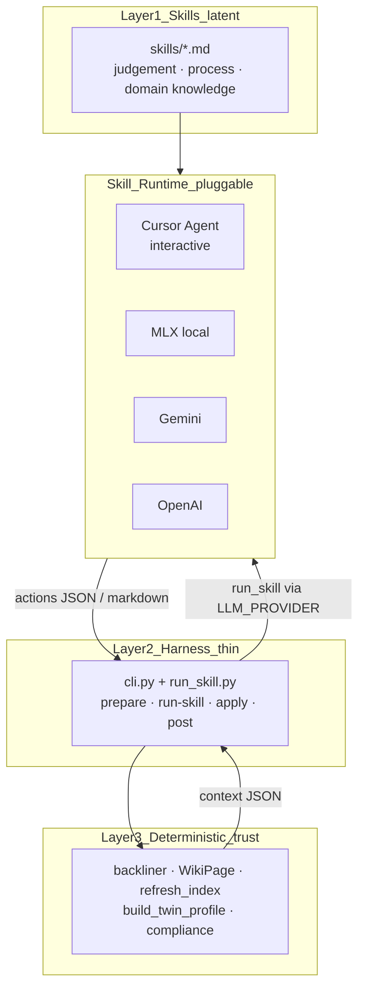
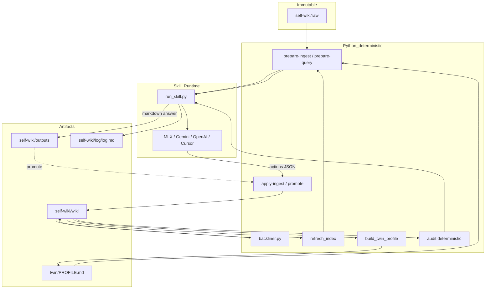
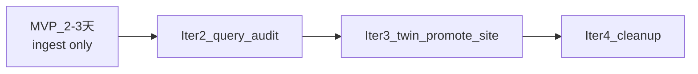

# 数字孪生重构计划（Karpathy LLM Wiki × Thin Harness）

## North Star（[notes.md](notes.md) 架构原则）

> **Push intelligence up into skills. Push execution down into deterministic tooling. Keep the harness thin.**

这是整个重构的唯一分层标准。任何新代码先问：它属于哪一层？



### 三层职责（严格边界）

| 层 | 放什么 | 不放什么 |
|----|--------|----------|
| **1. Skills（上）** | diarization、semantic match、合成答案、认知 lint、保真规则、语气 | hash、文件 I/O、schema 校验、图算法 |
| **2. Harness（中，薄）** | `cli.py` + `run_skill.py`：prepare/apply/post 路由；**仅**加载 skill 文件 + 调 provider；JSON 校验入口 | prompt 正文、检索启发式、semantic 判断、WikiPage merge、逐页 LLM 循环 |
| **3. Deterministic tooling（下）** | hash cache、backliner、INDEX、PROFILE 聚合、compliance、arithmetic | 任何需要「理解语义」的判断 |

**Harness ≠ 全部 Python。** 现有 `sync_wiki.py` / `query_wiki.py` 之所以「胖」，是把 Layer 1 和 Layer 3 混进了 Layer 2。重构 = **拆出来，各归其位**。

**notes 说 harness runs the LLM in a loop** — loop 的「大脑」在 **skills/**；**执行者（runtime）可插拔**：

| Runtime | 何时用 | 触发方式 |
|---------|--------|----------|
| **Cursor** | 交互式、需人工把关 | 读 pending JSON + skill，手动/agent 会话 |
| **MLX local** | 隐私、高频 ingest | `LLM_PROVIDER=mlx make sync` |
| **Gemini** | 深度 query / lint | `LLM_PROVIDER=gemini make query` |
| **OpenAI** | 可选云端 | `LLM_PROVIDER=openai make query` |

Harness 不 embed 判断力，只通过 **`run_skill(skill, context, provider)`** 委托 runtime。`llm_provider.py` 留在 Layer 2，职责收窄为 **provider 适配器**；**所有 provider 配置从 [`.env`](.env) 读取**（gitignored，不入库）。

### LLM 配置：`.env` 为唯一真相源

**原则：** 密钥、URL、默认 provider、model 全部在 repo 根目录 `.env`；脚本不 hardcode；不重复散落 `load_env()`。

| 变量 | 用途 | 示例 |
|------|------|------|
| `LLM_PROVIDER` | 默认 runtime | `mlx` / `gemini` / `openai` |
| `LLM_URL` | MLX / OpenAI-compatible endpoint | `http://127.0.0.1:8080/v1/chat/completions` |
| `LLM_MODEL` | local / openai model id | `mlx-community/gemma-4-e4b-it-4bit` |
| `OPENAI_API_KEY` | OpenAI 或 compatible API key | `sk-...` |
| `GEMINI_API_KEY` | Gemini | — |
| `GEMINI_MODEL` | Gemini model | `gemini-1.5-pro` |
| `MAX_CONTEXT_TOKENS` | token 预算 | provider-aware default |
| `RESERVED_OUTPUT_TOKENS` | 输出预留 | provider-aware default |
| `WORKSPACE_PATH` | repo 根路径 | 可选，默认自动推断 |
| `QUERY_WEB_HOST` / `QUERY_WEB_PORT` | 只读 site | `127.0.0.1` / `5050` |

**加载路径：** 仅 [scripts/config.py](scripts/config.py) 调 `load_env()` → 其余模块 `from config import ...` 或 `from llm_provider import ...`（内部已 load）。删除各脚本内重复的 `.env` 解析。

**Makefile override（可选，临时）：** notes 里的 `LLM_PROVIDER=gemini make query` 作为 **一次性 shell override**，覆盖 `.env` 默认值；日常以 `.env` 为准。

**交付物：** 新增 [`.env.example`](.env.example)（无密钥，可 commit）供参考；README 指向 `.env.example`。

```bash
# .env.example（片段）
LLM_PROVIDER=mlx
LLM_URL=http://127.0.0.1:8080/v1/chat/completions
LLM_MODEL=mlx-community/gemma-4-e4b-it-4bit
# GEMINI_API_KEY=
# GEMINI_MODEL=gemini-1.5-pro
# OPENAI_API_KEY=
```

### Cursor 与 `.env` 的关系（重要）

**Cursor Chat/Agent 不会自动读项目 `.env` 来选模型。** 两者是不同 runtime：

| | **Makefile / `run_skill`** | **Cursor Agent（交互）** |
|--|------------------------------|---------------------------|
| 谁读 `.env` | ✅ `llm_provider.py` | ❌ 不读（除非你在终端跑 `make`） |
| 模型从哪来 | `.env` 的 `LLM_PROVIDER` + keys | Cursor 设置里选的模型（UI） |
| 适用场景 | `make sync` / `make query` 自动化 | `prepare-*` 后在对话里跑 skill |
| prompt 从哪来 | `skills/*.md` | 同一套 `skills/*.md` |

**在 Cursor 里用 self-wiki 的三种方式：**

**1. 让脚本走 `.env`（推荐自动化 ingest）**
在 Cursor 集成终端执行：
```bash
make sync          # Python 读 .env → MLX/Gemini/OpenAI
make query Q="..."
```
终端里的 `make` 会加载 `.env`，与是否在 Cursor 里无关。

**2. 交互式跑 skill（模型在 Cursor UI 选）**
```bash
make prepare-ingest    # 只生成 pending JSON，不调 LLM
```
然后在 Cursor 对话中说：「读 `self-wiki/log/pending/ingest-*.json` 和 `skills/ingest.md`，产出 actions JSON」——此时用的是 **Cursor 当前选中的模型**（Settings → Models），不是 `.env`。

**3. 对齐 Cursor 与 `.env`（可选习惯，非强制）**

| `.env` 意图 | Cursor UI 建议 |
|-------------|----------------|
| `LLM_PROVIDER=mlx`（本地隐私） | 选本地/Ollama 类模型，或终端 `make sync` |
| `LLM_PROVIDER=gemini` | Cursor 选 Gemini，或终端 `make query` |
| `LLM_PROVIDER=openai` | Cursor 选 GPT，或终端 + `OPENAI_API_KEY` |

**Cursor 项目侧配置（不是 `.env`）：**
- [GEMINI.md](GEMINI.md) / `.cursor/rules` — resolver、工作流、何时用哪个 skill
- **不**把 API key 写进 GEMINI.md；密钥只在 `.env`（给 Python pipeline）

**若希望 Cursor 终端子进程继承 `.env`：** 可在 Cursor 用户 settings 配置 `terminal.integrated.env.osx` 指向变量，但 **更简单** 是让 Python `config.load_env()` 在脚本启动时加载——已实现，跑 `make` 即可。

---

**A. 自动化（Makefile + `.env`）** — 恢复 [notes.md](notes.md) tasks：
```bash
# 默认读 .env 中 LLM_PROVIDER=mlx
make sync

# 或临时 override（不写进 .env）
LLM_PROVIDER=gemini make query Q="..."
make audit && make lint
```

**B. 交互式（Cursor）** — Karpathy 默认工作流：
```bash
make prepare-ingest             # 输出 pending JSON
# 在 Cursor 读 skills/ingest.md + pending，产出 actions.json
make apply-ingest FILE=...      # 确定性落盘
```

同一 skill 文件，两种 runtime，** intelligence 不重复定义**。

### 决策 rubric（写代码前过一遍）

| 问题 | 是 → 放哪里 |
|------|------------|
| 需要理解 raw 语义？ | **ingest.md** skill |
| 需要合成/反驳/苏格拉底提问？ | **query.md** / **lint.md** skill |
| 只是读文件、写文件、校验 JSON？ | **harness** (`cli.py`) |
| 同样输入必须同样输出？ | **deterministic tool** (`backliner.py`, `apply_ingest.py`, …) |
| 用户 intent 该用哪个 skill？ | **resolver**（`description` in skill YAML；Agent 匹配，非 Python if/else） |

### Skill = method call（notes）

每个 skill 是一个「方法签名」：

```yaml
---
name: ingest-wiki
description: Compile new raw notes into the self-wiki; diarize, match themes, merge pages.
inputs:  pending JSON from prepare-ingest
outputs: actions JSON for apply-ingest
---
```

Harness 在 prepare 输出里 **指向 skill 路径**；Agent 读 skill 执行；harness 的 apply 只消费结构化 output。**Skill 告诉 model how；tooling 告诉 machine what.**

---

## 目标定位

你的选择是 **primarily 内部自省**（价值观、人格底层逻辑、决策分析）。因此「数字孪生」在此处的定义是：

> **一个由你策展 raw 源、由 skills 编译维护、由 tooling 确定性落盘的「稳定自我模型」**——runtime 可以是 Cursor、local MLX、Gemini 或 OpenAI，但 **prompt 只在 skills/**。

### 核心约束：**intelligence 在 skills，不在 Python**

| 层 | 谁 | 做什么 |
|----|-----|--------|
| **Skills** | `skills/*.md` | latent space：全部 prompt、判断、格式规则 |
| **Runtime** | Cursor / MLX / Gemini / OpenAI | 执行 skill（读 skill + context → 产出 JSON/markdown） |
| **Harness** | `cli.py`, `run_skill.py`, `llm_provider.py` | 薄 glue：prepare → run-skill → apply → post |
| **Tooling** | `apply_*`, `backliner`, … | deterministic space：hash、graph、index、merge |
| **禁止** | — | Python 内 embed prompt、semantic if/else、逐页 LLM 循环（旧 audit） |

**`run_skill.py` 是唯一允许 call LLM 的 harness 模块**，且每次调用 = 执行一个 skill 文件，不含业务分支。

## 设计评审（Draft Review）

### 总体评价：**方向正确，可执行；需补 4 处细节后再开工**

草案正确抓住了 Karpathy 与 notes 的交集：**compile > retrieve**、**fat skills / thin harness**、**diarization**、**index + log 复利**。现有代码已有 70% 地基（`sync_wiki`、`query_wiki`、`backliner`、`WikiPage`、双 LLM provider），重构是**收敛与分层**，不是推倒重来。

### 对齐良好的部分

| 原则来源 | 草案如何落地 |
|----------|-------------|
| Karpathy：三层 raw / wiki / schema | `GEMINI.md` + `skills/` 拆分 schema；raw 只读不变 |
| Karpathy：ingest / query / lint | 映射到 `make sync` / `query` / `audit`，并补 `log.md` |
| Karpathy：index-first 查询 | `log/index.md` + `INDEX.json` 双索引；query 先读目录再下钻 |
| Karpathy：查询复利 | `outputs/` + 可选 `make promote` |
| notes：diarization | 两阶段 ingest（nuggets → integrate） |
| notes：backliner 三类边 | 保留 `Evolved from` / `Mentioned in` / `Contradicts`；纳入 sync 闭环 |
| notes：thin harness JSON in / text out | `cli.py` 统一 I/O；Python 只做 cache/parse/save |
| 内部孪生定位 | `twin/PROFILE.md` 确定性聚合，非 query 幻觉 |

### 需修正或补充的缺口

**1. Skill resolver 未完整建模（notes 明确要求）**

notes 说：*「The description is the resolver」*——每个 skill 需 YAML front matter + `description`，harness 或 Cursor agent 按 intent 选 skill。草案只列了三个 `.md` 文件，未定义 resolver 契约。

**补：** 每个 `skills/*.md` 头部：

```yaml
---
name: ingest-wiki
description: Compile new raw notes into the self-wiki; diarize, match themes, merge pages.
input: { source_path, content, existing_themes }
output: { actions[] }  # JSON
---
```

`GEMINI.md` 瘦身为 **resolver 路由表**（skill 名 + description + 何时调用），而非重复 embed 全文 prompt。

**2. `INDEX.md` 与 `log/index.md` 路径冲突**

现状：[self-wiki/INDEX.md](self-wiki/INDEX.md) 是手写 Obsidian 枢纽（含 Hub 链接）；草案新建 [self-wiki/log/index.md](self-wiki/log/index.md) 为 Karpathy 自动目录。两者并存会混淆 query 与 Obsidian。

**补：**
- **机器/LLM 目录** → `self-wiki/log/index.md`（自动生成，每页一行）
- **人类导航枢纽** → 保留 `self-wiki/INDEX.md`，但 Hub 区块手维护；Alphabetical 区块改为「见 log/index.md」或自动生成 append
- `query_server` 首页链到两者，职责分开

**3. `query-web` → 只读 site（已纳入 agent-native 模型）**

[scripts/query_server.py](scripts/query_server.py) 当前混入了 Layer 1（`generate_query_answer`）。改为 Layer 3 只读浏览器：wiki / PROFILE / outputs / index；查询 intelligence 留在 Cursor query skill。

**4. 现有 wiki 体量与重复页（孪生噪声）**

`self-wiki/wiki/` 已有大量近义 synthesis 页（如多个「软技能提升…」变体）。仅删 `_self-wiki/` 不够；孪生 PROFILE 若链到 200+ Level-1 页会失焦。

**补（v1 软策略，不批量 merge）：**
- lint skill 新增 **duplicate_theme** 警告（title/alias 相似度 + 同 tag 簇）
- ingest skill 强化 semantic match（已有 `title_to_path` 逻辑），减少新重复
- PROFILE 只聚合 **Level 2 + type/principle + confidence ≥ 0.7**，Level 1 不进快照
- Level 2 强制规则改为 **lint 警告**，不对存量 wiki 硬 fail

**5. 现有「胖脚本」→ 三层拆分清单**

| 现有文件 | 迁入 Skills | 留 Harness | 留 Tooling |
|----------|-------------|------------|------------|
| `sync_wiki.py` | distill prompt、confidence 规则 | — | chunk 可读性可删；`apply_ingest` 用 WikiPage |
| `query_wiki.py` | synthesis prompt、Socratic 格式 | — | `prepare_query` 检索打分；`query-profiles.yaml` |
| `audit_wiki.py` | 认知 lint prompt | — | red link、orphan、compliance、duplicate_theme |
| `orchestrator.py` | — | prepare 调用 | hash cache |
| `backliner.py` | — | — | 全部保留 |
| `llm_provider.py` | — | — | 移出主路径（可选 test-llm） |

**6. 确定性层小债**

- [scripts/refresh_index.py](scripts/refresh_index.py) 硬编码 workspace 路径 → 改用 [scripts/config.py](scripts/config.py)
- `make sync` 当前只跑 `refresh_index`，**未跑 backliner**（草案正确指出）
- [scripts/main.py](scripts/main.py) stub 与 `SelfWikiArchitect` 叙事应删除，避免双入口

**7. `make all` 推荐顺序（补全闭环）**

```
sync:  ingest → backliner → refresh_index → build_twin_profile → append log
audit: compliance → lint skill → append log
```

`twin/PROFILE.md` 必须在 backliner 之后生成，否则 `Contradicts` 边不完整。

### 风险与缓解

| 风险 | 缓解 |
|------|------|
| 两阶段 ingest 双倍 MLX token/延迟 | chunk 仍用 local；integrate 可 batch nuggets；大文件保持现有 chunk 策略 |
| `promote` 污染 wiki | 默认 dry-run；需 `--confirm`；合并目标页由用户指定；打 `type/shift` 或 append Distillation |
| skills 与 GEMINI 双源漂移 | GEMINI 只保留 philosophy + resolver 表；具体 prompt 只在 skills |
| 删 `_self-wiki/` 丢数据 | 先 `diff -rq _self-wiki self-wiki`；独有文件 migrate 后 archive |

Reid AI（[notes.md](notes.md)）保留为**参照**：长期语料 → 一致人格；v1 不实现对外代表。

---

### LLM 调用纪律（不是零调用，是「skill 粒度调用」）

| 操作 | 旧（胖脚本） | 新（thin harness + skill） |
|------|-------------|---------------------------|
| **sync** | Python embed prompt，逐 chunk 调 API | 1× `run_skill(ingest)` per changed raw → `apply` |
| **query** | 2× API（expand + synthesis） | 1× `run_skill(query)` per question |
| **lint** | 651× 逐页 API | 0 LLM in `make audit`；可选 1× `run_skill(lint)` |

Provider 由 **`.env` → `LLM_PROVIDER`** 决定；Makefile 可 shell override。默认 MLX（隐私）。

---

## 现状与差距

| 维度 | 已有 | 相对 Karpathy / notes 的差距 |
|------|------|------------------------------|
| 三层 | `raw/`、`wiki/`、[GEMINI.md](GEMINI.md) | Schema 全塞在 GEMINI；无独立 `skills/` |
| 编译 (Ingest) | [scripts/sync_wiki.py](scripts/sync_wiki.py) + hash cache | 缺「单源触达多页」的显式 diarization 阶段；ingest 后未自动 `backliner` |
| 查询 (Query) | [scripts/query_wiki.py](scripts/query_wiki.py) (~1k 行) | **Harness 过胖**（prompt、profile、检索全在 Python）；Karpathy 要求 index-first + 答案可回写 wiki |
| 体检 (Lint) | [scripts/audit_wiki.py](scripts/audit_wiki.py) + compliance test | 无 [log.md](https://gist.github.com/karpathy/442a6bf555914893e9891c11519de94f) 时间线 |
| 导航 | [self-wiki/log/INDEX.json](self-wiki/log/INDEX.json) + 手写 [self-wiki/INDEX.md](self-wiki/INDEX.md) | 缺 Karpathy 式 **index.md 自动生成**（每页一行摘要 + 分类） |
| 图 | [scripts/backliner.py](scripts/backliner.py) | 未纳入 `make sync` / `make all` 闭环 |
| 文档 | [ARCHITECTURE.md](ARCHITECTURE.md) 引用不存在的 `orchestrator_v2.py` | 与代码漂移；[scripts/main.py](scripts/main.py) 为 stub |



---

## 目标架构（对齐 [notes.md](notes.md) + Karpathy gist）

### 1. 三层 + 孪生元数据（不改 raw 只读原则）

```
dev.self-wiki/
├── GEMINI.md              # 薄入口：哲学 + 目录约定 + 指向 skills
├── skills/
│   ├── ingest.md          # 编译：diarize → cluster → merge（含 YAML description）
│   ├── query.md           # 查询：index-first → synthesize → provenance
│   ├── lint.md            # 体检：矛盾/孤儿/陈旧/幻觉/duplicate_theme
│   └── query-profiles.yaml # 确定性检索配置（values/personality/swot triggers）
├── self-wiki/
│   ├── raw/               # Level 0，只读
│   ├── wiki/              # Level 1–2，LLM 维护
│   ├── twin/
│   │   └── PROFILE.md     # 孪生「当前自我快照」（由 Level-2 页定期/手动刷新）
│   ├── outputs/           # 查询快照（已有）
│   └── log/
│       ├── INDEX.json     # 机器索引（保留，供检索打分）
│       ├── index.md       # 人类/LLM 目录（Karpathy index，自动生成）
│       └── log.md         # 追加式时间线（ingest/query/lint）
└── scripts/
    ├── cli.py                 # Layer 2: harness 入口
    ├── run_skill.py           # Layer 2: 读 skill + context → llm_provider（唯一 LLM 出口）
    ├── llm_provider.py        # Layer 2: MLX / Gemini / OpenAI 适配器
    ├── prepare_ingest.py      # Layer 3
    ├── apply_ingest.py        # Layer 3
    ├── prepare_query.py       # Layer 3
    ├── promote_output.py      # Layer 3
    ├── orchestrator.py        # Layer 3
    ├── models.py              # Layer 3
    ├── backliner.py           # Layer 3
    ├── refresh_index.py       # Layer 3
    └── build_twin_profile.py  # Layer 3
```

**Harness 体积预算：** `cli.py` + `run_skill.py` 不含 prompt 正文；`run_skill` 只做 `read(skill) + read(context) + call_llm + parse_json`。

**prepare/apply 契约（JSON in, text out）：**

```json
// self-wiki/log/pending/ingest-<timestamp>.json（prepare 输出）
{
  "skill": "skills/ingest.md",
  "sources": [{ "path": "diary/foo.md", "content": "...", "hash": "..." }],
  "existing_themes": [{ "title": "...", "path": "...", "alias": "..." }],
  "instructions": "Agent: run ingest skill, write actions to ingest-actions.json"
}

// ingest-actions.json（Agent 输出，apply 输入）
{ "actions": [{ "target_title": "...", "confidence_score": 0.9, "new_body_content": "...", "tags": [] }] }
```

**`twin/PROFILE.md`**（内部孪生核心，非 Reid 对外）：
- 从 `level: 2` + `type/principle` 页 **确定性聚合**（backliner + YAML 扫描），不由单次 query 幻觉生成
- 区块：Operating principles / Active tensions（来自 backliner `Contradicts`）/ Recent shifts（`type/shift`）/ 最后编译时间
- Query：runtime 读 PROFILE + evidence pack（`prepare-query` 组装）；经 `run_skill(query)` 或 Cursor 执行

### 3. Makefile：provider 可切换（恢复 notes.md tasks）

| Target | `.env` 建议 | 流程 |
|--------|------------|------|
| `make sync` | `LLM_PROVIDER=mlx` | prepare → run-skill ingest → apply → post |
| `make query Q=...` | `LLM_PROVIDER=gemini` | prepare → run-skill query → save-output |
| `make audit` | — | 100% deterministic（零 LLM） |
| `make lint` | `LLM_PROVIDER=gemini` | audit.md + PROFILE → **run-skill lint**（1 次） |
| `make prepare-*` | — | 仅输出 pending JSON（给 Cursor 交互模式） |
| `make site` | — | 只读 wiki 浏览器 |

**交互式替代：** 跳过 `run-skill`，在 Cursor 读同一 skill 文件 + pending JSON，手动 `apply`。

**日常闭环（自动化，读 `.env`）：**
```bash
make sync                              # uses .env LLM_PROVIDER
make query Q="..."                     # or LLM_PROVIDER=gemini make query ...
make audit && make lint
```

### 4. Ingest：Diarization 在 skill runtime，Integrate 在 tooling

1. **Diarize（ingest skill via run-skill 或 Cursor）**：从 raw 提取 nuggets，输出 `actions[]` JSON
2. **Integrate（apply_ingest.py）**：校验 schema → 匹配 INDEX → WikiPage.save → 更新 cache

### 5. 知识层级（保留，lint 软收紧）

沿用 GEMINI 的 Level 0–2：
- **Lint 警告**（非 hard fail）：Level 2 页建议 ≥2 个 raw `Sources` 或 `type/shift` 升级路径
- `PROFILE.md` 只链接 Level 2 + `type/principle` + `confidence ≥ 0.7`，摘要一行，不复制全文
- 存量 200+ Level-1 页通过 ingest semantic match 自然收敛，不做 v1 批量合并

### 6. 清理与收敛（降低孪生噪声）

- **`_self-wiki/`**：归档或删除重复树（与 `self-wiki/` 并行会造成 index/孪生漂移）；迁移前用 diff 确认无独有 raw
- **更新** [ARCHITECTURE.md](ARCHITECTURE.md) 与 [README.md](README.md) 使其与真实入口 `cli.py` / skills 一致
- **删除或实现** [scripts/main.py](scripts/main.py) stub，避免双 orchestrator 叙事

---

## Walkthrough：一个新 raw 文件的全链路（重构成功后）

**场景：** 你在 `self-wiki/raw/diary/2026-06-02-on-boundaries.md` 写了一篇关于边界的日记。系统从未处理过此文件（hash cache 无记录）。

---

### 路径 A — 自动化（`make sync`，读 `.env`）

`.env` 示例：`LLM_PROVIDER=mlx`，本地 MLX 已在 `LLM_URL` 运行。

#### Step 0 — 你只做一件事

把 markdown 放进 raw（**只读层，脚本永不改 raw**）：

```
self-wiki/raw/diary/2026-06-02-on-boundaries.md
```

#### Step 1 — `make sync` 触发 harness

`cli.py sync` 内部顺序：

```
orchestrator.get_changed_files()   # md5 对比 cache → 发现新文件
prepare_ingest.py                  # Layer 3：组装 context
run_skill.py ingest                # Layer 2：1× LLM call
apply_ingest.py                    # Layer 3：写 wiki
post-ingest                        # Layer 3：backliner → index → twin → log
```

#### Step 2 — prepare（deterministic，零 LLM）

`orchestrator.py` 发现 `diary/2026-06-02-on-boundaries.md` hash 不在 cache。

`prepare_ingest.py` 写出：

```
self-wiki/log/pending/ingest-2026-06-02T143022.json
```

内容示意：

```json
{
  "skill": "skills/ingest.md",
  "generated_at": "2026-06-02T14:30:22",
  "sources": [{
    "path": "diary/2026-06-02-on-boundaries.md",
    "content": "今天意识到在关系里...\n",
    "hash": "a1b2c3...",
    "language": "Chinese"
  }],
  "existing_themes": [
    { "title": "关于价值交换与精力边界的原则", "path": "wiki/关于价值交换与精力边界的原则.md", "alias": "..." },
    { "title": "人际关系中的真诚表达", "path": "wiki/....md" }
  ]
}
```

`existing_themes` 来自 `INDEX.json`（651 个主题的 title/alias 列表），**不是** LLM 猜的。

#### Step 3 — run_skill ingest（唯一 LLM 调用，intelligence 在 skill）

`run_skill.py` 做且只做：

1. 读 `skills/ingest.md` 全文（diarization 规则、confidence 打分、`[AI Synthesis]` 标签规则）
2. 读 pending JSON
3. 拼 messages → `llm_provider.get_llm_response()`（`.env` → MLX）
4. 解析返回 JSON → 写入：

```
self-wiki/log/pending/ingest-actions-2026-06-02T143022.json
```

skill 产出示意（**latent space** — 可能触达多页）：

```json
{
  "actions": [
    {
      "target_title": "关于价值交换与精力边界的原则",
      "confidence_score": 0.88,
      "confidence_rationale": "原文直接讨论精力边界与拒绝...",
      "bilingual_alias": "Principles of Value Exchange and Energy Boundaries",
      "level": 2,
      "summary": "边界不是冷漠，而是对有限精力的诚实分配。",
      "description": "关系中的精力边界与价值交换原则",
      "new_body_content": "> 今天意识到...\n\n[AI Synthesis] 这与既有「giver vs specialist」张力相关。",
      "tags": ["type/principle", "type/shift"]
    },
    {
      "target_title": "Principles of Interpersonal Dynamics",
      "confidence_score": 0.72,
      "new_body_content": "...",
      "tags": ["type/synthesis"]
    }
  ]
}
```

一篇 raw → **2 个 wiki 页**被更新（Karpathy「单源触达 10–15 页」的缩小版）。

#### Step 4 — apply_ingest（deterministic，零 LLM）

`apply_ingest.py` 对每个 action：

1. JSON schema 校验（必填字段、confidence 0–1）
2. `target_title` 匹配 `INDEX.json` → 找到已有页或 `WikiPage.create_new()`
3. 追加 body：`### Distillation (2026-06-02) - source: [[../raw/diary/2026-06-02-on-boundaries.md]]`
4. 更新 front matter：`confidence`、`last_updated`、`tags`
5. `WikiPage.save()` — 固定模板（Summary `>`、Evolution、Sources、Backlinks 占位）
6. 更新 `orchestrator` cache：该 raw 的 md5 记入 `.sync_cache.json`

**raw 仍不变。** 变更只在 `self-wiki/wiki/`。

#### Step 5 — post-ingest（deterministic 链）

| 脚本 | 做什么 |
|------|--------|
| `backliner.py` | 扫描全文 `[[链接]]`；更新各页 Backlinks（Evolved from / Mentioned in / **Contradicts**） |
| `refresh_index.py` | 重写 `INDEX.json` + `log/index.md`（每 wiki 页一行摘要） |
| `build_twin_profile.py` | 从 Level-2 + `type/principle` 页聚合 → `twin/PROFILE.md`（含 Active tensions） |
| append `log.md` | `## [2026-06-02] ingest \| diary/2026-06-02-on-boundaries.md \| 2 pages updated` |

#### Step 6 — 你查看结果

- Obsidian / `make site` 打开更新后的 wiki 页
- `twin/PROFILE.md` 看边界原则是否进入 Operating principles
- Backlinks 里 **Contradicts** 若与旧原则冲突，会显示 cognitive friction

**全程 LLM 调用：1 次**（run_skill ingest）。其余全部 deterministic。

---

### 路径 B — 交互式（Cursor，prepare + 手动 skill）

适合想人工把关 distillation 质量。

```bash
make prepare-ingest    # 只到 Step 2，不调 LLM
```

在 Cursor 对话：

> 读 `self-wiki/log/pending/ingest-*.json` 和 `skills/ingest.md`，产出 actions JSON 写到 `self-wiki/log/pending/ingest-actions.json`

（模型由 Cursor UI 选，不读 `.env`）

```bash
make apply-ingest FILE=self-wiki/log/pending/ingest-actions.json
make post-ingest
```

Step 4–6 与路径 A 相同。

---

### 之后：基于这篇 raw 的 query（可选）

```bash
make query Q="我在关系里的边界原则是什么？"
```

| 步骤 | 层 | 细节 |
|------|-----|------|
| prepare_query | tooling | 读 `twin/PROFILE.md` + `log/index.md`；用 `query-profiles.yaml` 关键词打分；选出 top-K wiki 页 snippet → evidence pack JSON |
| run_skill query | harness + skill | 1× LLM（`.env` gemini）；读 `skills/query.md` + evidence pack |
| save-output | tooling | 写入 `self-wiki/outputs/我在关系里的边界原则是什么-2026-06-02.md` |
| promote（可选） | tooling | 高价值分析合并回某个 wiki 页 |

答案带 `(Source: [[self-wiki/wiki/关于价值交换与精力边界的原则.md]])`，可溯源到 raw。

---

### 文件变更一览（路径 A 成功后）

| 路径 | 变更 |
|------|------|
| `raw/diary/2026-06-02-on-boundaries.md` | **不变** |
| `wiki/关于价值交换与精力边界的原则.md` | 追加 Distillation 段 + Sources |
| `wiki/Principles of Interpersonal Dynamics.md` | 可能追加 Mentioned in |
| `log/INDEX.json` | 更新 metadata |
| `log/index.md` | 自动目录刷新 |
| `twin/PROFILE.md` | 若 level:2 则可能更新 principles / tensions |
| `log/log.md` | +1 行 ingest 记录 |
| `log/.sync_cache.json` | 记录 raw hash |
| `log/pending/*.json` | 可保留作审计，或清理 |

---

### 失败时怎么办（deterministic 兜底）

| 失败点 | 行为 |
|--------|------|
| run_skill 返回非法 JSON | apply 不执行；cache **不**更新；log 记 `ingest FAILED` |
| apply 校验 confidence < 0.5 | 仍写入但强制 `[Socratic Observation]` 前缀（skill 规则） |
| 同一 raw 未改再 sync | orchestrator skip（零 LLM） |
| 你想重做 | 删 cache 中该 raw 条目 → 再 `make sync` |

---

## 执行策略：MVP 优先，再迭代

**决策：** 先跑通 **ingest 全链路**（一篇 raw → wiki），验证 thin harness / fat skills 架构；query、lint、twin、site 后续分批做。



### MVP 范围（~2–3 天）

**目标：** `make sync` 走 `prepare → run-skill(ingest) → apply → post-ingest`；Walkthrough 路径 A 可演示。

| 做 | 不做（留给迭代） |
|----|------------------|
| `skills/ingest.md` | `skills/query.md`, `skills/lint.md` |
| `prepare_ingest`, `apply_ingest`, `run_skill`, `cli.py` | `prepare_query`, `promote_output` |
| `post-ingest`: backliner + refresh_index + log.md + index.md | `build_twin_profile` / PROFILE |
| `.env.example`, config 收敛 | openai provider 正式化（MLX+Gemini 够用） |
| GEMINI 瘦身 + ingest resolver | 完整 resolver 三 skill |
| `make sync`, `prepare-ingest`, `apply-ingest`, `post-ingest` | 新 `make query` / `make lint` |
| `sync_wiki.py` 弃用或薄 wrapper | 拆 `query_wiki.py`, `audit_wiki.py` |
| 最小 README 更新 | `_self-wiki` 归档、ARCHITECTURE 大改 |

**MVP 验收：**
1. 新增 1 个 raw → `make sync` → 对应 wiki 页更新 + Sources 可追溯
2. 同一 raw 再 sync → 0 LLM（cache skip）
3. `sync_wiki.py` 内无 embed prompt（prompt 只在 `skills/ingest.md`）
4. post-ingest 后 backliner + INDEX.json + log/index.md + log.md 已更新
5. 可选：`make prepare-ingest` + Cursor 手动 apply 路径可用

**MVP 期间旧命令：**
- `make query` / `make audit` / `make query-web` → **保持现状**，不阻塞日常使用

---

### Iter 2 — Query + Audit（~2 天）

- `skills/query.md` + `prepare_query.py` + `run_skill query` + save-output
- `audit_wiki.py` 去掉逐页 LLM；`skills/lint.md` + `make lint`（1× 全局）
- `query-profiles.yaml` 从 query_wiki 抽出

**验收：** `make query Q=...` 走新链路；`make audit` 零 LLM；`make lint` 可选 1×

---

### Iter 3 — 孪生 + 复利 + Site（~2 天）

- `build_twin_profile.py` + `twin/PROFILE.md`；纳入 post-ingest
- `promote_output.py` + `make promote`
- `query_server.py` → 只读 site（wiki / PROFILE / outputs）

**验收：** PROFILE 在 ingest 后更新；query 读 PROFILE；site 无 LLM 调用

---

### Iter 4 — 清理与质量（~1 天）

- `_self-wiki/` diff → migrate → archive
- ARCHITECTURE.md / README / notes.md 与真实入口对齐
- 删 `main.py` stub；duplicate_theme deterministic lint
- `llm_provider` 正式支持 openai（若需要）

---

## 实施阶段（按 MVP 优先重排）

### MVP（Phase M — 2–3 天）
- [ ] `skills/ingest.md`（从 sync_wiki 迁 prompt + confidence 规则）
- [ ] `.env.example`；`load_env` 仅经 `config.py`
- [ ] `prepare_ingest.py` / `apply_ingest.py`（复用 `WikiPage`, `orchestrator`）
- [ ] `run_skill.py` + `cli.py`（ingest only）
- [ ] `refresh_index.py` → `log/index.md`；`append_log()` 规范
- [ ] `Makefile`: `sync`, `prepare-ingest`, `apply-ingest`, `post-ingest`
- [ ] `sync_wiki.py` 标记 deprecated 或删除；`make sync` → 新链路
- [ ] 最小 README：MVP 用法 + Walkthrough 链接

### Iter 2（Phase Q — ~2 天）
- [ ] `skills/query.md` + `prepare_query.py` + query 的 run-skill 路径
- [ ] 瘦化/替换 `query_wiki.py`
- [ ] `audit_wiki.py` 去 LLM；`skills/lint.md` + `make lint`

### Iter 3（Phase T — ~2 天）
- [x] `build_twin_profile.py`；post-ingest 纳入 twin
- [x] `promote_output.py`
- [x] `query_server` thin wrapper（与 make query 同管线；非只读 site）

### Iter 4（Phase C — ~1 天）
- [x] `_self-wiki` 处理；ARCHITECTURE；compliance 扩展；删 stub
- [x] `make quality`；openai provider；duplicate_theme + Level-2 soft guidance

---

## 成功标准

### MVP 完成即可 ship
1. ingest 三层边界成立：prompt 在 `skills/ingest.md`；`run_skill` 唯一 LLM 出口；apply/post deterministic
2. 一篇 raw walkthrough（计划内 Walkthrough 节）端到端可跑
3. 旧 `make query` / `audit` 仍可用

### 全量完成（Iter 4 后）
1. query / lint / twin / site / cleanup 全部到位
2. Skill 粒度调用：sync/query/lint 各 ≤1 call per unit
3. Provider 可切换 via `.env`

---

## 明确不做（v1 / MVP）

**MVP 阶段不做：**
- query / lint skill 与 harness 重构
- PROFILE / twin 层
- query-web 改造、promote、`_self-wiki` 清理

**全量 v1 仍不做：**
- Reid 式对外代表
- 向量 RAG
- 逐页 LLM audit（651×）
