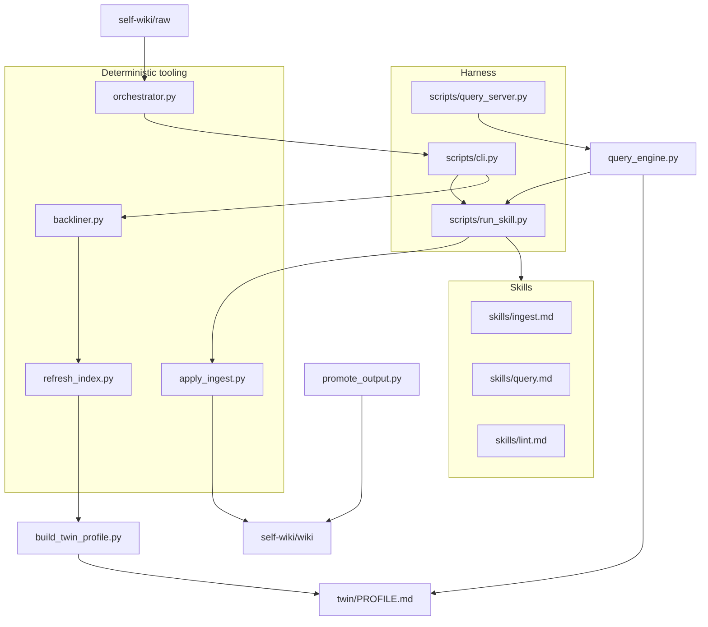

# Architecture: dev.self-wiki

> **Thin harness, fat skills.** Prompts and judgement live in `skills/`; Python prepares context, runs skills, and applies deterministic tooling.

## Three layers

| Layer | Role | Location |
|-------|------|----------|
| **Skills** | Prompts, profiles, lint rules, output formats | `skills/*.md`, `skills/query-profiles.yaml` |
| **Harness** | CLI / web entry, `run_skill` (only LLM call site per unit) | `scripts/cli.py`, `scripts/run_skill.py`, `scripts/query_server.py` |
| **Tooling** | Hash cache, merge, index, backlinks, compliance | `scripts/orchestrator.py`, `apply_ingest.py`, `backliner.py`, … |



## Repository layout

```
dev.self-wiki/
├── skills/                    # Fat skills (prompts only)
│   ├── ingest.md
│   ├── query.md
│   ├── lint.md
│   └── query-profiles.yaml
├── scripts/
│   ├── cli.py                 # Main harness: sync, query, lint, prepare-*
│   ├── run_skill.py           # Load skill + pending → LLM once
│   ├── config.py              # Paths, .env
│   │
│   ├── prepare_ingest.py      # Raw → pending JSON (no LLM)
│   ├── apply_ingest.py        # actions[] → wiki (WikiPage)
│   ├── orchestrator.py        # Raw file hash cache
│   ├── ingest_helpers.py
│   ├── wiki_themes.py
│   ├── refresh_index.py       # INDEX.json + log/index.md
│   ├── log_utils.py
│   ├── backliner.py
│   │
│   ├── prepare_query.py       # Retrieval pack → pending JSON
│   ├── query_retrieval.py     # Profile detect, rank, evidence
│   ├── query_engine.py        # prepare → run-skill(query) → save
│   ├── save_query_output.py
│   ├── query_wiki.py          # Interactive CLI wrapper
│   ├── query_server.py        # FastAPI: ask + browse
│   │
│   ├── audit_wiki.py          # Deterministic audit report
│   ├── prepare_lint.py        # Context for global lint
│   ├── build_twin_profile.py  # Deterministic twin/PROFILE.md
│   ├── promote_output.py      # Query output → wiki (compound loop)
│   │
│   ├── models.py              # WikiPage schema
│   ├── llm_provider.py
│   ├── sync_wiki.py           # Deprecated → cli.py sync
│   └── test_*.py
│
├── self-wiki/                 # Knowledge store
│   ├── raw/                   # Level 0 — read-only input
│   ├── wiki/                  # Level 1–2 — compiled notes
│   ├── outputs/               # Query snapshots, reports
│   ├── log/
│   │   ├── pending/           # Pending JSON for skills
│   │   ├── INDEX.json         # Machine index (topics)
│   │   ├── index.md           # Karpathy-style directory
│   │   └── log.md             # Append-only run log
│   ├── INDEX.md               # Human Obsidian hub (hand-maintained)
│   └── audit.md               # make audit + make lint output
│
├── twin/                      # Iter 3: PROFILE.md (digital twin snapshot)
├── archive/                   # Legacy archive notes (_self-wiki removed)
├── GEMINI.md                  # Operating manual + resolver hints
├── Makefile                   # make sync | query | audit
```

## Pipelines

### Ingest (`make sync`)

```
orchestrator (hash) → prepare_ingest → run_skill(ingest) → apply_ingest → post_ingest
post_ingest = backliner → refresh_index → build_twin_profile → append log.md
```

One LLM call per changed raw file (per skill unit). Prompt: [skills/ingest.md](skills/ingest.md).

After ingest, `twin/PROFILE.md` aggregates Level-2 / `type/principle` pages (confidence ≥ 0.7), backlink **Contradicts** edges, and recent `type/shift` pages. Query and lint read this snapshot deterministically in `prepare_query` / `prepare_lint`.

### Query (`make query` / `make query-web`)

```
prepare_query (deterministic retrieval) → run_skill(query) → save_query_output
```

One LLM call per question. Prompt: [skills/query.md](skills/query.md). Profiles: [skills/query-profiles.yaml](skills/query-profiles.yaml).

`prepare_query` injects an excerpt of `twin/PROFILE.md` into the pending JSON user message (twin context, no extra LLM).

### Compound loop (`make promote`)

```
query output (self-wiki/outputs/) → promote_output → append to wiki page + tag type/shift
next post_ingest → PROFILE picks up shift → next query reads updated twin
```

Dry-run by default; pass `--confirm` (or `CONFIRM=1` via Makefile) to merge. Promoted sections appear under `### Promoted from query` on the target wiki page.

### Audit & lint

| Command | LLM | Output |
|---------|-----|--------|
| `make audit` | No | `self-wiki/audit.md` |
| `make audit LINT=1` | Once (lint skill) | Merges cognitive section into `audit.md` |

## Entry points

| You want… | Use |
|-----------|-----|
| Full automation | `make sync`, `make query`, `make audit` |
| Cursor interactive | `python scripts/cli.py prepare-ingest` / `prepare-query` |
| Web browse + ask | `make query-web` |
| Unit tests (dev) | `make test` |
| Legacy sync alias | `python scripts/sync_wiki.py` → `cli.py sync` |

## LLM discipline

| Operation | Calls |
|-----------|-------|
| sync (per changed raw) | 1× `run_skill(ingest)` |
| query (per question) | 1× `run_skill(query)` |
| lint | 0 in audit; optional 1× `run_skill(lint)` |

Provider: `.env` → `LLM_PROVIDER` (`mlx` default; `gemini`, `openai` cloud opt-in). Makefile may override per command.

## Data model

- **Raw (L0)**: Immutable source notes under `self-wiki/raw/`.
- **Synthesis (L1)**: Integrated themes in `self-wiki/wiki/`.
- **Principle (L2)**: Compressed mental models in `self-wiki/wiki/` with `type/principle`.

Wiki pages enforced via `WikiPage` ([scripts/models.py](scripts/models.py)): YAML front matter, Socratic summary, Evolution, Sources, Backlinks.

## Testing

| Test | Command |
|------|---------|
| All unit tests | `make test` |
| Wiki + audit (CI-style) | `make audit` |
| LLM connectivity | `python scripts/test_llm_conn.py` |
