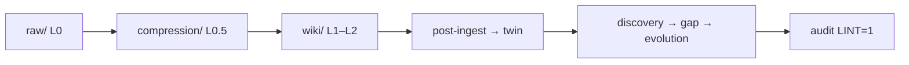

# Design: dev.self-wiki

> **Thin harness, fat skills.** Judgement in `skills/`; Python prepares context, runs skills, applies deterministic tooling.

Daily commands: [README.md](README.md). **Composer-first** for ingest (Cursor + skills); **Python** for trust layer (backlinks, index, twin, audit). Batch ingest via `make` is opt-in (`ALLOW_PYTHON_LLM=1`).

---

## Flow



```
raw/  ──compress──►  compression/  ──wiki-synthesize──►  wiki/
                          │                                    │
                          ▼                                    ▼
                    discovery → gap → evolution          post-ingest → twin
```

| Layer | Path | Role |
|-------|------|------|
| L0 Raw | `self-wiki/raw/{_posts,origin-apple-notes,twitter}/` | Source truth — append only |
| L0.5 | `self-wiki/compression/` | Per-source digests; path mirrors raw |
| L1–L2 | `self-wiki/wiki/` | Themes & principles |
| External | `log/sources.json` | Twitter catalog — not your beliefs |
| Twin | `twin/PROFILE.md` | Snapshot after post-ingest |

**No raw → wiki shortcut.** Wiki updates go through compression + [wiki-synthesize](skills/wiki-synthesize.md) → `apply_ingest.py`.

Status: `make progress` · `make wiki-synth-status`

---

## Code layout

| Layer | Role | Where |
|-------|------|-------|
| Skills | Prompts, profiles, output formats | `skills/*.md`, `*-profiles.yaml` |
| Harness | CLI, web, one LLM call per unit | `cli.py`, `run_skill.py`, `query_server.py` |
| Tooling | Hash diff, merge, index, backlinks | `orchestrator.py`, `apply_*.py`, `backliner.py`, … |

Harness pattern: `prepare_*.py` → `log/pending/*.json` → `run_skill` → `apply_*` → optional `post-ingest`.

---

## Stages

| # | Stage | How | Command |
|---|-------|-----|---------|
| 0 | Drop files | `_posts/`, `origin-apple-notes/`, `twitter/` under `raw/` | — |
| 1 | Twitter catalog | No LLM | `make register-reference` |
| 2 | raw → compression | Composer: [ingest-summary](skills/ingest-summary.md) / [ingest-thoughts](skills/ingest-thoughts.md). Batch: `make compress` | `make sync` |
| 2b | compression → wiki | Links digest → 1–3 wiki pages | `make wiki-synthesize` |
| 3 | Trust layer | Backlinks · INDEX · twin · log | `make post-ingest` |
| 4 | L1/L2 pages | From discovery or red links; L2 needs `confidence ≥ 0.7` for twin | Composer + post-ingest |
| 5 | Agents | Pattern → gap → state reports | `make agents` / `make cycle` |
| 6 | Audit | Compliance; `LINT=1` adds cognitive lint | `make audit` |

**Provenance** — end every compression digest with:

```markdown
- (Source: [[raw/_posts/learning/foo.md]])
```

**Backfill waves** (compression already done):

| Wave | Command |
|------|---------|
| W1 apple-notes | `make wiki-synthesize-apple-notes WAVE=theme_links LIMIT=50` |
| W2 posts | `make wiki-synthesize FOLDER=_posts LIMIT=50` |
| W3 rest | incremental batches |

Skip `compression/twitter/**`. Providers: `COMPRESS_LLM_PROVIDER`, `WIKI_SYNTH_LLM_PROVIDER`.

**Internal flows**

```
raw → compression:  orchestrator → prepare_compress → run_skill → compression/
compression → wiki:  prepare_wiki_synthesize → run_skill → apply_ingest → wiki/
trust:              backliner → refresh_index → build_twin_profile → log.md
query:              prepare_query → run_skill → save output
cycle:              discover → gap → evolution → post-ingest → audit LINT=1
```

**LLM calls:** 1× compression skill per raw file · 1× wiki-synthesize per digest · 1× query per question · optional 1× lint.

---

## Commands

| Goal | Command |
|------|---------|
| New/changed raw (batch) | `make sync` |
| Composer path | digest in Cursor → `make post-ingest` → `make audit` |
| Ask wiki | `make query Q="…"` / `make query-web` |
| Weekly | `make cycle` |
| Backfill wiki | `make wiki-synthesize … POST_INGEST=1` |
| Promote query → wiki | `make promote FILE=… TARGET=… CONFIRM=1` |
| Status | `make progress` / `make wiki-synth-status` |

---

## Avoid

| Don't | Do instead |
|-------|------------|
| raw → wiki in one step | compress → wiki-synthesize → post-ingest |
| Edit `raw/` from automation | Append only |
| Skip post-ingest | Backlinks and twin go stale |
| `gap` before discover | `make agents` or discover first |
| wiki-synthesize on twitter | external catalog only |

Wiki standards: [AGENTS.md](AGENTS.md)
