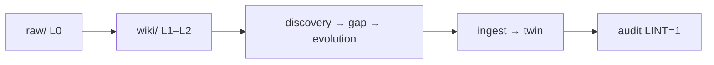

# Design: dev.self-wiki

> **Thin harness, fat skills.** Judgement in `skills/`; Python prepares context, runs skills, applies deterministic tooling.

Daily commands: [README.md](README.md). **Composer-first** for ingest (Cursor + skills); **Python** for trust layer (memex, backlinks, index, twin, audit). Batch ingest via `make` is opt-in (`ALLOW_PYTHON_LLM=1`).

---

## Flow



```
raw/  ──wiki-synthesize──►  wiki/
                          │
                          ▼
                    discovery → gap → evolution
                          │
                          ▼
                    ingest → twin
```

| Layer | Path | Role |
|-------|------|------|
| L0 Raw | `self-wiki/raw/{_posts,origin-apple-notes,twitter}/` | Source truth — append only |
| L1–L2 | `self-wiki/wiki/` | Themes & principles |
| External | `log/sources.json` | Twitter catalog — not your beliefs |
| Twin | `self-wiki/twin/PROFILE.md` | Snapshot after ingest |

Long raw files are chunked in-memory (`scripts/raw_chunking.py`) before wiki-synthesize.

Status: `make progress` · `make wiki-synth-status`

---

## Code layout

| Layer | Role | Where |
|-------|------|-------|
| Skills | Prompts, profiles, output formats | `skills/*.md`, `*-profiles.yaml` |
| Harness | CLI, one LLM call per unit | `cli.py`, `run_skill.py` |
| Tooling | Hash diff, merge, index, backlinks | `orchestrator.py`, `apply_*.py`, `memex/`, … |

Harness pattern: `prepare_*.py` → `log/pending/*.json` → `run_skill` → `apply_*` → optional `ingest`.

---

## Stages

| # | Stage | How | Command |
|---|-------|-----|---------|
| 0 | Drop files | `_posts/`, `origin-apple-notes/`, `twitter/` under `raw/` | — |
| 1 | Twitter catalog | No LLM | `make register-reference` |
| 2 | raw → wiki | [wiki-synthesize](skills/wiki-synthesize.md) → 1–3 wiki pages | `make sync` / `make wiki-synthesize` |
| 3 | Agents | Pattern → gap → state reports | `make agents` |
| 4 | Trust layer | Memex · backlinks · INDEX · twin · log | `make ingest` |
| 5 | L1/L2 pages | From discovery or red links; L2 needs `confidence ≥ 0.7` for twin | Composer + ingest |
| 6 | Weekly reflect | agents + ingest + audit | `make reflect` |
| 7 | Audit | Compliance; `LINT=1` adds cognitive lint | `make audit` |

**Provenance** — cite raw in wiki updates:

```markdown
- (Source: [[raw/_posts/learning/foo.md]])
```

**Backfill waves**

| Wave | Command |
|------|---------|
| W1 apple-notes | `make wiki-synthesize-apple-notes WAVE=theme_links LIMIT=50` |
| W2 posts | `make wiki-synthesize FOLDER=_posts LIMIT=50` |
| W3 rest | incremental batches |

Skip `raw/twitter/**` for wiki-synthesize. Provider: `LLM_PROVIDER` (default `mlx`).

**Internal flows**

```
raw → wiki:  orchestrator → prepare_wiki_synthesize → run_skill → apply_ingest → wiki/
trust:       memex graph → wiki backlinks → refresh_index → build_twin_profile → log.md
query:       prepare_query → run_skill → save output
reflect:     discover → gap → evolution → ingest → audit LINT=1
```

**LLM calls:** 1× wiki-synthesize per raw file (or chunk) · 1× query per question · optional 1× lint.

---

## Commands

| Goal | Command |
|------|---------|
| New/changed raw (batch) | `make sync` |
| Wiki-synthesize only | `make wiki-synthesize LIMIT=20` |
| Trust layer | `make ingest` |
| Browse locally | `make ingest && make publish BUILD_ONLY=1 && make site` |
| Memex stats | `make memex CMD="stats"` |

See `make help` and [AGENTS.md](AGENTS.md).
