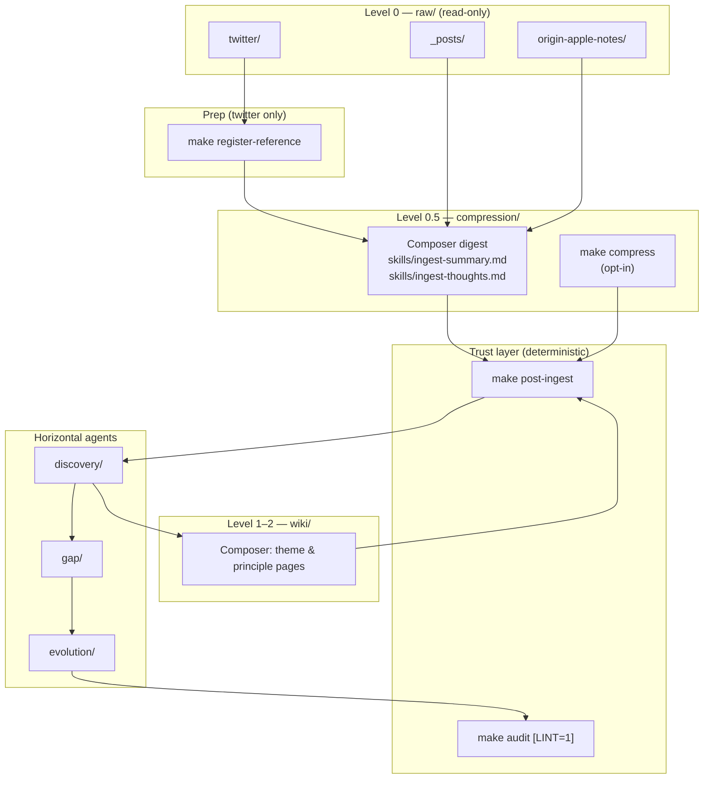

# Pipeline: raw → compression → wiki → agents

Composer-first workflow when new material arrives. Python runs the **trust layer** (backlinks, index, twin, audit); LLM work happens in Cursor or via opt-in `make` targets.

## Map



**Check status anytime:** `make progress` → `log/PROGRESS.md`, `log/pipeline_progress.json`

---

## Step 0 — Drop files

| Folder | Content |
|--------|---------|
| `self-wiki/raw/_posts/` | Posts, diary, learning notes |
| `self-wiki/raw/origin-apple-notes/` | Apple Notes exports |
| `self-wiki/raw/twitter/` | Twitter exports / likes |

Never edit `raw/` from automation — append only.

---

## Step 1 — Twitter catalog (no LLM)

```bash
make register-reference
```

Writes `self-wiki/log/sources.json` (`type/external` — not your beliefs).

---

## Step 2 — raw → compression

### Default: Composer

| Source | Skill |
|--------|-------|
| `_posts/` | `skills/ingest-summary.md` |
| `origin-apple-notes/` | `skills/ingest-thoughts.md` |

Write to `self-wiki/compression/…` mirroring `raw/…`. End every digest with:

```markdown
- (Source: [[raw/_posts/learning/foo.md]])
```

Match source language (中文 → 中文, English → English).

### Optional: batch compress (cloud)

```bash
make compress LIMIT=50
make compress FOLDER=_posts LIMIT=20
make compress POST_INGEST=1    # compress then post-ingest
```

Requires `ALLOW_PYTHON_LLM=1` (set inside the Makefile target). Prefer Composer for quality.

```bash
make compress-status FOLDER=_posts
```

---

## Step 3 — post-ingest

```bash
make post-ingest
```

Deterministic: `backliner.py` → backlinks · `refresh_index` → INDEX · `build_twin_profile` → twin.

Run after **compression** changes or **wiki** edits.

---

## Step 4 — compression → wiki (compounding)

Not automatic. `post-ingest` does not create L1 pages.

In Composer, from discovery findings or red links:

- **L1** — `self-wiki/wiki/*.md`, `level: 1`, `type/synthesis`
- **L2** — `level: 2`, `type/principle`, confidence ≥ 0.7 for twin

See [AGENTS.md](../AGENTS.md) for front matter, Evolution, traceability.

Then:

```bash
make post-ingest
```

---

## Step 5 — discovery → gap → evolution

Run in order after a meaningful ingest (weekly or monthly).

| Stage | Output | Skill | Command |
|-------|--------|-------|---------|
| discovery | `discovery/{date}.md` | `skills/discovery.md` | Composer, or `make discover` |
| gap | `gap/{date}.md` | `skills/gap.md` | Composer, or `make gap` |
| evolution | `evolution/{date}.md` | `skills/evolution.md` | Composer, or `make evolution` |

- **discovery** — cross-file patterns in compression + wiki  
- **gap** — unknown-unknowns + reading list (from latest discovery)  
- **evolution** — metrics snapshot + what changed  

```bash
make agents && make post-ingest && make audit LINT=1
```

---

## Step 6 — audit

```bash
make audit              # compliance → audit.md
make audit LINT=1       # + cognitive lint (gemini in .env)
```

---

## Rhythms

### Incremental (new notes this week)

```bash
# 1. Composer: digest → compression/
# 2.
make post-ingest
make audit
```

### Full weekly loop

```bash
make progress
# Composer: finish compression/, then discovery → gap → evolution
# Optional: update wiki/ from discovery
make post-ingest
make audit LINT=1
```

---

## Cheat sheet

```
raw/  ──digest──►  compression/  ──post-ingest──►  INDEX + twin + backlinks
                         │
                         ▼
                   discovery/ → gap/ → evolution/
                         │
                         ▼
                      wiki/  ──post-ingest──►  L2 → twin
```

## Avoid

| Don't | Do instead |
|-------|------------|
| `make sync` | Composer digest + `post-ingest` |
| Edit `raw/` | Add new files only |
| Skip `post-ingest` | Backlinks and twin go stale |
| `gap` before `discovery` | gap reads latest discovery report |

## Query (read-only)

```bash
make query Q="how do I think about leadership?"
make query-web
```

Does not modify the vault.
