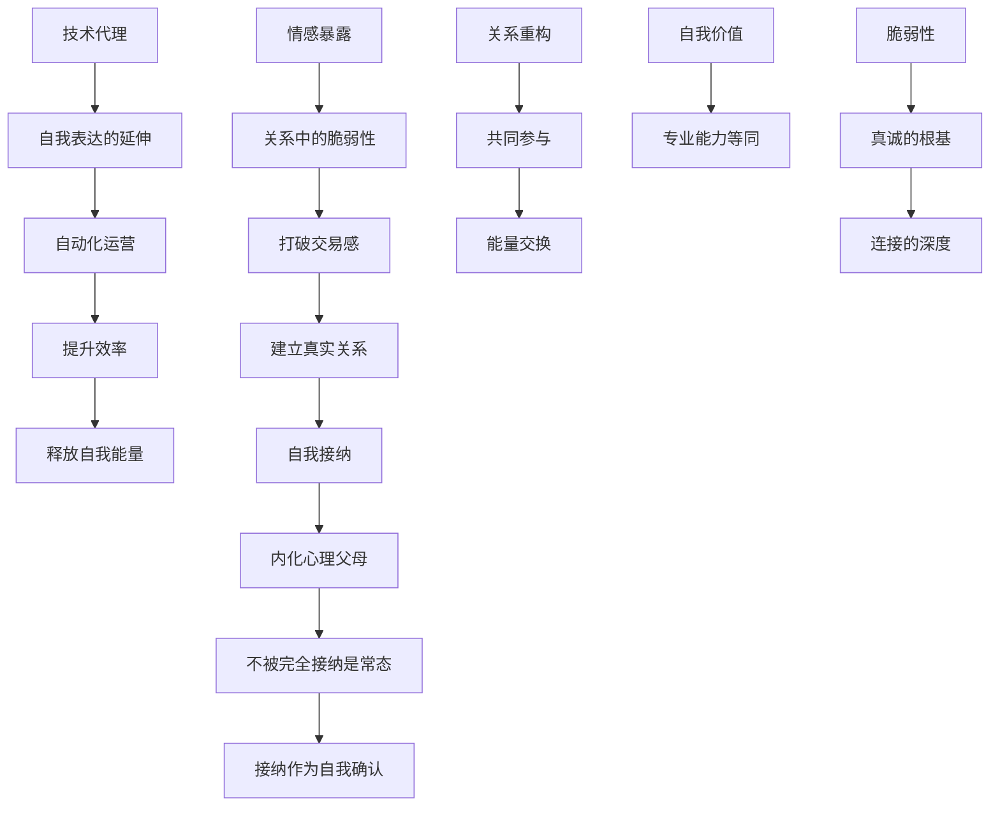

```markdown
---
title: "Discovery 2026-07-20"
description: "从自我叙事到关系动态的深层结构：连接、脆弱、自主性与技术赋能的交叉点"
level: 1
last_updated: 2026-07-20T12:00:00Z
tags: [type/synthesis, agent/discovery, topic/self, topic/relationships, topic/technology]
---

> [!summary] 本发现集围绕“自我”与“关系”的动态张力展开，揭示了作者在技术理性与情感真实之间建立平衡的路径：从“架构师”到“情感同盟”的身份转换，从“解决问题”到“共同参与”的关系模式，以及通过AI工具实现效率与自我表达的协同。核心主题是“脆弱性作为连接的桥梁”与“技术作为自我实现的延伸”。

> [!warning] 未和解张力：技术理性与情感脆弱性的冲突——如何在追求系统优化的同时，不牺牲真实的情感暴露与自我接纳？

## At a glance

| ID | Theme | Cluster | Confidence | Method |
|----|-------|---------|------------|--------|
| **F1** | 情感暴露是打破交易感的唯一利器 | 关系与自我 | 0.95 | [AI Synthesis] |
| **F2** | 技术作为自我表达的延伸（AI代理） | 技术与自我 | 0.92 | [Socratic Observation] |
| **F3** | 从“解决问题”到“共同参与”的关系重构 | 领导与沟通 | 0.90 | [Literal] |
| **F4** | 自我价值与专业能力等同 | 自我认知 | 0.88 | [Literal] |
| **F5** | 虚弱性是真诚的根基 | 情感与信任 | 0.94 | [Socratic Observation] |

**Corpus:** 11 raw samples · wiki status: active · pass label: discovered · date: 2026-07-10 to 2026-07-19

## Theme map



## Tensions

| 张力 | 一侧 | 另一侧 | Finding |
|------|------|--------|---------|
| 技术理性 vs 情感脆弱 | 用系统优化生活 | 用暴露脆弱建立真实连接 | **F1** 情感暴露是打破“交易感”的唯一利器，唯有展露不完美才能测试谁是真的爱你这个人 |
| 自我控制 vs 自我接纳 | 保持逻辑与秩序 | 接纳不完美与情绪波动 | **F4** 自我价值与专业能力等同，但“展示”是愿景叙事，非说谎；真正的价值在“我能做什么”而非“我已拥有什么” |
| 问题解决 vs 能量交换 | 作为外部解决方案 | 作为关系中的能量伙伴 | **F3** 从“解决问题”到“共同参与”，将“我来解决”变为“我们来一起看” |

## Findings

### 关系与自我

#### F1 · 情感暴露是打破交易感的唯一利器
> 一个关系中，如果只以“你是否能解决问题”来判断价值，就会陷入“交易感”——即关系被简化为功能交换。真正的连接始于情感暴露：当一个人敢于展露不完美、沮丧或脆弱时，关系才可能从“交易”转向“共情”。

| 压缩 | 原文 |
|------|------|
| [[raw/self-wiki/raw/_posts/new-apple-notes/2026-07-19.md|微调-情感暴露]] | “情感暴露是打破‘交易感’的唯一利器<br>+ 唯有当你敢于展露那个不完美、甚至有点沮丧的自己时，你才能测试出谁是真的爱你这个人，而不是爱你那套‘价值系统’” |

**Evidence chain**
1. [[raw/self-wiki/raw/_posts/new-apple-notes/2026-07-19.md]] → [[raw/self-wiki/raw/_posts/new-apple-notes/2026-07-18.md]] 
2. [[wiki/self-wiki/raw/_posts/new-apple-notes/2026-07-18.md]] — 情感一致性 → 情绪可见化 → 邀请式沟通

**Method:** [AI Synthesis] | [cross-raw] | [wiki Evolution delta] | [Socratic Observation]

> [!quote] Raw excerpt  
> “唯有当你敢于展露那个不完美、甚至有点沮丧