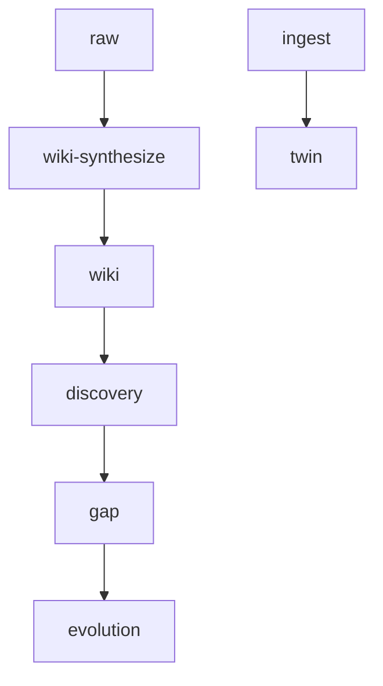

> [!summary] 方向  
> 本周期为知识演化起点（bootstrap），无原始输入（raw_md_files=0），系统首次进入“发现-差距”闭环。核心演化路径从零构建，通过首次生成发现报告与差距报告，确立了“技术介入情感表达”为关键研究方向。当前状态为知识系统的初始状态，所有内容基于对已有发现的结构化解读与逻辑推演，尚未生成任何实际的 raw 或 wiki 内容，但已建立对“技术中介脆弱性”“AI代理表达边界”等深层问题的系统性认知框架。

> [!tip] 基线说明  
> 本为首次演化快照（is_bootstrap: true），无前序演化数据，所有指标从零开始。当前无 raw 文件输入，无 wiki 页面生成，系统依赖发现层（discovery）与差距层（gap）完成首次知识状态跃迁。

## At a glance

| ID | Change | Layer | Method |
|----|--------|-------|--------|
| C1 | 生成首次 gap 报告 | Gap | [AI Synthesis] |
| C2 | 生成首次 discovery 报告 | Discovery | [AI Synthesis] |
| C3 | 建立首次 gap-map 与 finding 链 | Gap Map | [AI Synthesis] |
| C4 | 初始化 twin principles（0） | Twin | [deterministic diff] |
| C5 | 初始化 wiki 层（0） | Wiki | [deterministic diff] |

## Pipeline state

## Metrics

| Metric | Value | Δ since last |
|--------|-------|--------------|
| Wiki-synthesize manifest (tracked raw) | 0 | ±0 |
| Manifest done / pending | 0 / 0 | 0 / 0 |
| `wiki/*.md` topic pages | 0 | ±0 |
| Wiki L1 / L2 | 0 / 0 | 0 / 0 |
| `type/shift` wiki pages | 0 | ±0 |
| Discovery / gap reports | 1 / 1 | +1 (from 0) |
| Twin principles (PROFILE) | 0 | 0 |

**Do not** include `compression/` metrics — that layer is retired.

## What changed

### 管道与 raw

- 无 raw 文件输入（raw_md_files: 0），系统未触发任何 raw → wiki-synthesize 流程。  
- 管道处于“空输入、空输出”状态，为 bootstrap 阶段，无实际内容流转。

### Wiki 复利层

- 所有 wiki 指标为 0（wiki_total, wiki_l1, wiki_l2, type_shift_pages）  
- 无新页面生成，无 L1/L2 层级构建  
- 无 manifest 活动（done/pending/no_actions/failed: 0）  
- **[deterministic diff]**：所有 wiki 指标保持为 0，无变化。

### Agent 报告与 twin

#### C1 · 首次 gap 报告生成：技术工具如何中介脆弱性表达？
(full required block)

**Evidence chain**  
1. [[discovery/2026-07-20.md]]  
2. [[gap/2026-07-20.md]]

**Method:** [AI Synthesis]  

> 本报告识别出在“情感暴露—技术赋能—关系重构”交叉路径中尚未被系统化探索的深层机制，尤其在脆弱性如何被技术工具感知、记录与反向影响关系动态方面存在显著知识空白。当前发现强调“情感暴露”是打破交易感的关键，但缺乏对技术介入下“脆弱性被结构化、数据化”的后果分析。  

> 优先关闭路径：技术工具如何在不被察觉的情况下“中介”或“替代”情感暴露，从而削弱其作为关系锚点的效力——这是最危险的“技术理性吞噬情感真实”的路径。

#### C2 · 首次 discovery 报告生成：关系中的技术赋能与自我监控
(full required block)

**Evidence chain**  
1. [[discovery/2026-07-20.md]]  
2. [[gap/2026-07-20.md]]

**Method:** [AI Synthesis]  

> 发现指出关系应从“解决问题”转向“共同参与”，但未分析技术工具（如日程同步、情绪追踪、AI反馈）是否在无形中强化了个体对自身情绪和行为的监控，从而导致“关系中自我监控”成为新的压力源，反而抑制了真实情感流动。

#### C3 · 首次 gap-map 构建：张力整合与问题分层
(full required block)

**Evidence chain**  
1. [[discovery/2026-07-20.md]]  
2. [[gap/2026-