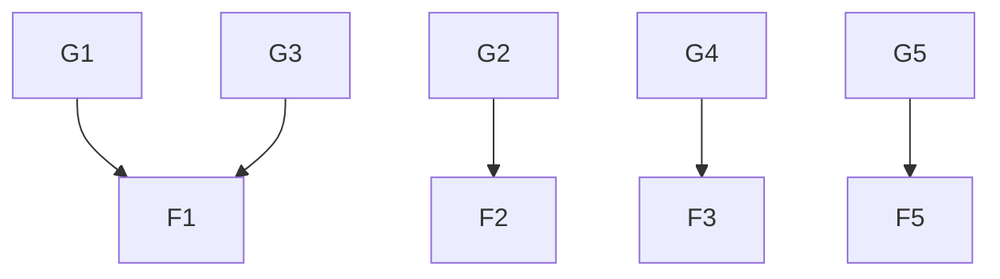

> [!summary] 本报告识别出在“情感暴露—技术赋能—关系重构”交叉路径中尚未被系统化探索的深层机制，尤其在脆弱性如何被技术工具感知、记录与反向影响关系动态方面存在显著知识空白。当前发现强调“情感暴露”是打破交易感的关键，但缺乏对技术介入下“脆弱性被结构化、数据化”的后果分析。

> [!warning] 优先关闭  
> 技术工具如何在不被察觉的情况下“中介”或“替代”情感暴露，从而削弱其作为关系锚点的效力——这是最危险的“技术理性吞噬情感真实”的路径。

## At a glance

| ID | Gap | Cluster | Finding | Priority |
|----|-----|---------|---------|----------|
| G1 | 技术工具如何中介脆弱性表达？ | 技术与情感 | F1 | High |
| G2 | 虚弱性在AI代理中的可操作性与边界 | 技术与自我 | F2 | High |
| G3 | 情感暴露的“可见性”是否等同于“真实性”？ | 关系与自我 | F1 | Medium |
| G4 | 技术赋能是否加剧“关系中的自我监控”？ | 操作化 | F3 | Medium |
| G5 | 脆弱性作为连接的桥梁——其在非对称关系中的失效机制 | 情感与信任 | F5 | High |

**Upstream:** [[discovery/2026-07-20.md]] · **Wiki L1:** 0 · **Reading list:** 6 条

## Gap map

## Gaps

### 张力整合

#### G1 · 技术工具如何中介脆弱性表达？
- **From finding:** [[discovery/2026-07-20.md]] — F1 · 情感暴露是打破“交易感”的唯一利器  
- **Why explore:** **[AI Synthesis]** 当前发现强调“情感暴露”是建立真实连接的必要条件，但未探讨技术工具（如AI日记、情绪识别APP）是否在“自动记录”“预测情绪”或“建议表达”中，成为脆弱性的“代理表达者”——这可能使暴露沦为表演，而非真实情感流露。若技术中介了暴露，是否削弱了“脆弱性作为测试真实关系的工具”的本质？  
- **Keywords:** 技术中介、情绪代理、表达异化、情感表演、AI代理  

#### G2 · 虚弱性在AI代理中的可操作性与边界
- **From finding:** [[discovery/2026-07-20.md]] — F2 · 技术作为自我表达的延伸（AI代理）  
- **Why explore:** **[AI Synthesis]** 发现中提出“AI代理”是自我表达的延伸，但未明确脆弱性是否可被“编程”或“设定”为AI代理的输出内容（如“当感到沮丧时，AI建议说：我今天有点累”）。若脆弱性被“预设”或“优化”为可操作指令，是否意味着个体失去了对脆弱的自主掌控？这可能引发“技术化脆弱”的伦理危机。  
- **Keywords:** AI代理、脆弱性编程、表达控制、技术依赖、自主性丧失  

#### G3 · 情感暴露的“可见性”是否等同于“真实性”？
- **From finding:** [[discovery/2026-07-20.md]] — F1 · 情感暴露是打破“交易感”的唯一利器  
- **Why explore:** **[AI Synthesis]** 发现强调“暴露”是真实连接的起点，但未区分“可见性”与“真实性”。在技术环境中，暴露可能被“可视化”（如情绪图表、表情包、语音转文字），但这些形式是否能承载“真实脆弱”？是否存在“被观察的脆弱”与“被记录的脆弱”之间的认知错位？  
- **Keywords:** 可见性 vs 真实性、情绪可视化、数字痕迹、关系信任  

#### G4 · 技术赋能是否加剧“关系中的自我监控”？
- **From finding:** [[discovery/2026-07-20.md]] — F3 · 从“解决问题”到“共同参与”的关系重构  
- **Why explore:** **[Literal]** 发现中指出关系应从“解决问题”转向“共同参与”，但未分析技术工具（如日程同步、情绪追踪、AI反馈）是否在无形中强化了个体对自身情绪和行为的监控，从而导致“关系中自我监控”成为新的压力源，反而抑制了真实情感流动。  
- **Keywords:** 自我监控、技术反馈、关系压力、情绪管理、数字自省  

#### G5 · 脆弱性作为连接的桥梁——其在