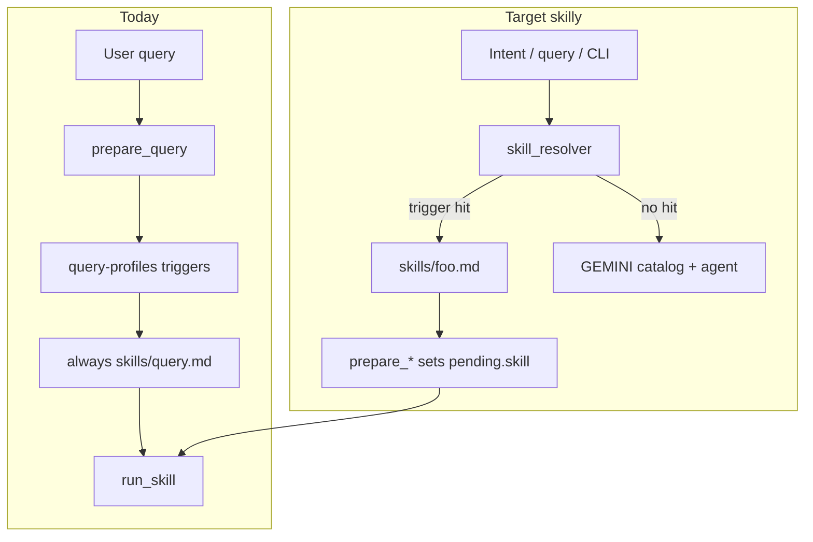

# Skilly skills: named, pattern-matched, reusable

## What you want

When user intent (or input text) **matches a pattern** associated with a **named skill**, the harness should **reuse that skill file** on the next run—not always default to `query.md` / `ingest.md`. You chose:

- **Scope**: any intent (query now + future custom workflows with markdown/JSON via `run_skill`)
- **Resolution**: **hybrid** — deterministic triggers first; agent reads catalog when no match

## Current state (gap)

| Piece | Today | Gap |
|-------|--------|-----|
| Skill files | 3 fixed: [`skills/ingest.md`](skills/ingest.md), [`query.md`](skills/query.md), [`lint.md`](skills/lint.md) | No discovery of new `.md` skills |
| Front matter | `name`, `description` parsed but **only body** used ([`parse_skill`](scripts/run_skill.py) ignores meta for routing) | “Description is the resolver” is **not implemented** in harness |
| Pattern → behavior | [`skills/query-profiles.yaml`](skills/query-profiles.yaml) + [`query_retrieval.detect_profile_confidence`](scripts/query_retrieval.py) | Profiles tweak **instructions inside one** `query.md` skill—not separate skill files |
| Pending JSON | `prepare_*` **hardcodes** `skill` + `kind` ([`prepare_query.py`](scripts/prepare_query.py) L57–59, [`prepare_ingest.py`](scripts/prepare_ingest.py) L73–75) | No `resolve_skill()` |
| `run_skill` | Only `kind` in `ingest` \| `query` \| `lint` ([`run_skill.py`](scripts/run_skill.py) L24, L218–229) | New skills need explicit `kind` + output contract |



## Recommended design: skill registry + hybrid resolver

### 1. Registry file — `skills/registry.yaml`

Single source of truth for **named, triggerable** skills (deterministic layer). Example shape:

```yaml
skills:
  query-wiki:
    path: skills/query.md
    kind: query
    triggers: []          # default query fallback
    priority: 0

  query-values:
    path: skills/query-values.md   # optional split later
    kind: query
    triggers: ["价值观", "core values", "what are my values"]
    priority: 10
    prepare: query           # which prepare_* module

  ingest-wiki:
    path: skills/ingest.md
    kind: ingest
    triggers: []           # sync path does not use text triggers
    priority: 0

  lint-global:
    path: skills/lint.md
    kind: lint
    triggers: []
    priority: 0
```

**Rules (deterministic, no LLM):**

- Normalize input (reuse `normalize_text` from [`query_retrieval.py`](scripts/query_retrieval.py)).
- Score like profiles: substring trigger hits + optional keywords; highest `priority` wins ties.
- **Migrate** existing [`query-profiles.yaml`](skills/query-profiles.yaml) `triggers` into registry entries (either keep profiles as “instruction overlays” for one release, or map each profile → named skill in phase 2).

### 2. Resolver module — `scripts/skill_resolver.py`

Thin harness (no prompts):

| Function | Role |
|----------|------|
| `load_registry()` | Parse `skills/registry.yaml` |
| `list_skills()` | All entries + scanned `skills/*.md` front matter |
| `resolve_skill(text, *, command="query")` | Return `{ name, path, kind, profile?, score }` |
| `build_resolver_catalog()` | Markdown table for GEMINI / Cursor: name, description, triggers, when to use |

**Hybrid behavior:**

1. If `resolve_skill` score &gt; threshold → set `pending["skill"]` and log `Resolved skill: query-values (score=8)`.
2. Else → `pending["skill"]` stays default; set `pending["_resolver_hint"]` = catalog excerpt so **agent** can override in Cursor mode (`prepare-query` only, no `run-skill`).

### 3. Wire into prepare + CLI

| Entry | Change |
|-------|--------|
| [`prepare_query.py`](scripts/prepare_query.py) | After `build_retrieval_pack`, call `resolve_skill(query)`; set `pending["skill"]`, `pending["resolved_skill"]`, keep `profile` for retrieval |
| [`cli.py`](scripts/cli.py) | New: `cli.py skills list`, `cli.py skills resolve "…"` (debug) |
| [`cmd_query`](scripts/cli.py) | Log resolved skill name at start (mirror sync model logging) |
| Optional | `cli.py run-skill --skill skills/foo.md` if pending omitted |

**Sync / ingest:** unchanged default (`ingest-wiki`); registry entry documents the skill for catalog consistency. Future: raw path patterns (e.g. `#qa/` → `skills/ingest-qa.md`) via `triggers` on `raw_path` in `prepare_ingest`.

### 4. Extend `run_skill` for “any intent” (controlled)

Add registry-driven **output kinds** without growing Python branches arbitrarily:

```yaml
# in registry or skill front matter
kind: text          # → current query/lint path
kind: ingest        # → JSON actions + apply
kind: text          # default for new custom skills
```

In [`run_skill.py`](scripts/run_skill.py):

- Read `kind` from **pending** (set by resolver), not only hardcoded three names.
- Treat `kind: text` same as `query`/`lint` (markdown out).
- Unknown `kind` → clear error listing allowed kinds from registry.

New custom skills only need: `.md` file + registry row + (for query-like) reuse `prepare_query` or a thin `prepare_custom.py` that builds `user_message` from a template in front matter.

### 5. Agent catalog — [`GEMINI.md`](GEMINI.md)

Add a **Skill resolver** section (auto-generated or hand-maintained):

- Built-in commands: `make sync` → `ingest-wiki`; `make query` → resolver; `make lint` → `lint-global`.
- Rule: “If pending has `_resolver_hint` or no strong trigger, read catalog and pick skill by `description`.”
- Do **not** duplicate full prompts—only name, description, triggers, output type.

Optional: `make skills-catalog` runs `python scripts/cli.py skills catalog > skills/CATALOG.md`.

### 6. “Use next time” workflow (skillify)

Documented user/agent flow to add a skill without code changes:

1. Create `skills/my-analysis.md` with YAML `name`, `description`, `kind: text`, `triggers: [...]`.
2. Append entry to `skills/registry.yaml` with `priority` &gt; default.
3. Run `cli.py skills resolve "your typical question"` to verify match.
4. `make query Q="..."` uses new skill automatically.

No auto-learning from LLM runs in v1 (avoids silent prompt drift); optional v2: append to registry from successful `outputs/` with human confirm.

## Migration path (phased)

**Phase 1 — Resolver + catalog (low risk)**

- Add `registry.yaml` mirroring current 3 skills + map `query-profiles` triggers to **same** `query.md` but logged as `profile` + `skill=query-wiki`.
- `resolve_skill` in `prepare_query`; CLI `skills list|resolve`; GEMINI resolver table.

**Phase 2 — Split profile prompts into named skills (optional)**

- Extract `strict_instruction` blocks from [`query-profiles.yaml`](skills/query-profiles.yaml) into `skills/query-values.md`, etc.
- Registry points triggers → those files; slim profiles YAML to retrieval keywords only.

**Phase 3 — Custom workflows**

- New `kind: text` skills (e.g. `weekly-review.md`) with `prepare_custom` or shared template in front matter.
- Raw-path triggers for specialized ingest variants.

## Files to touch (implementation)

| File | Action |
|------|--------|
| [`skills/registry.yaml`](skills/registry.yaml) | **New** — named skills + triggers |
| [`scripts/skill_resolver.py`](scripts/skill_resolver.py) | **New** — load, score, catalog |
| [`scripts/prepare_query.py`](scripts/prepare_query.py) | Set `skill` from resolver |
| [`scripts/cli.py`](scripts/cli.py) | `skills` subcommand; query log line |
| [`scripts/run_skill.py`](scripts/run_skill.py) | Generic `text` kind; log resolved skill from pending |
| [`GEMINI.md`](GEMINI.md) | Resolver section |
| [`skills/README.md`](skills/README.md) | How to add a skilly skill |
| [`scripts/test_wiki_compliance.py`](scripts/test_wiki_compliance.py) or new `test_skill_resolver.py` | Trigger scoring tests |

## Out of scope (v1)

- LLM-based skill selection in Python (stays agent/Cursor fallback).
- Auto-generating skill files from past runs without review.
- Cursor `.cursor/skills` duplication (can link to same `skills/*.md` later).

## Success criteria

- Adding a row to `registry.yaml` + a new `skills/foo.md` causes `make query` with matching text to log and use `foo.md` without editing `prepare_query.py` or `run_skill.py` branches.
- Unmatched queries still work via `query.md` + agent catalog hint.
- `make sync` / ingest behavior unchanged unless raw triggers added explicitly.
