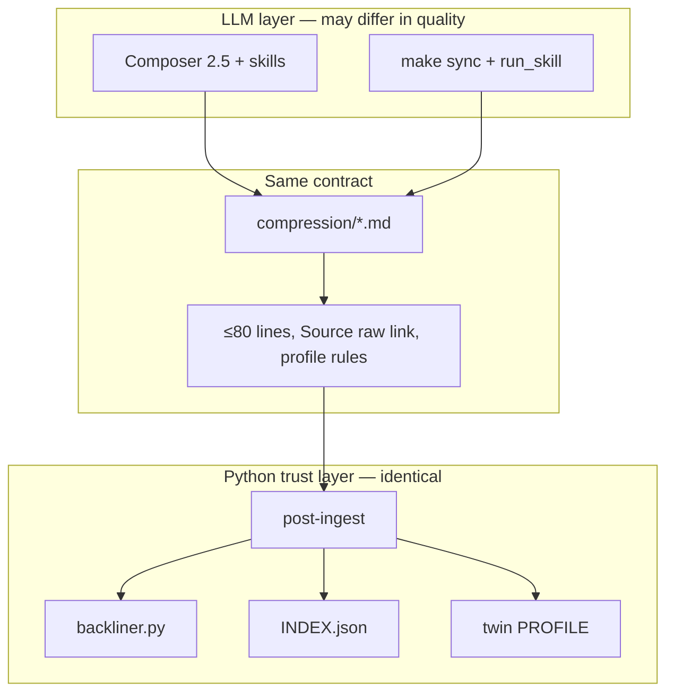
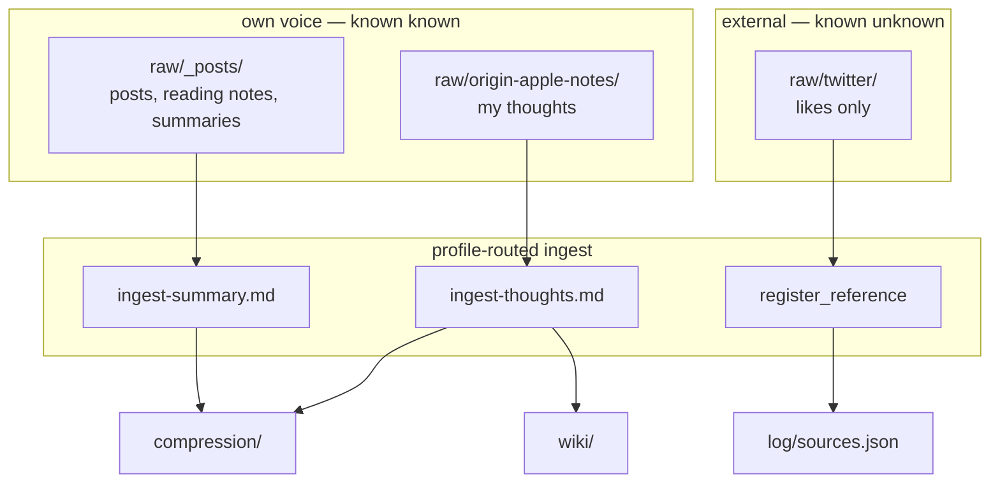
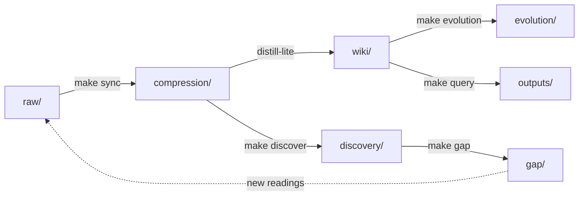
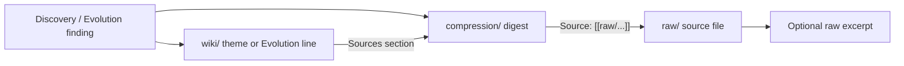

# Second Brain + Socratic Mirror — Unified Design

> **Overview:** Karpathy compounding LLM wiki + Socratic Mirror + Rumsfeld four-quadrant model. Source-type-aware ingest (not one MLX prompt). Pipeline: compression → discovery → gap → evolution → dialogue.
>
> **Current `raw/` input (3 folders only):** `_posts/`, `origin-apple-notes/`, `twitter/`. No `books/`, `clips/`, or `qa/` — do not create empty folders.
>
> **Default ingest:** Composer 2.5 bootstrap (first time) + changed-only passes; Python for twitter catalog + `post-ingest`.

## Implementation checklist

### P0 — Composer-first (do first)

- [x] **One-shot bootstrap** — skills + scripts + `make compress` / `make build` (Composer or Gemini batch)
- [x] **Update related docs** — see [§ Related documentation](#related-documentation) (P0: AGENTS, notes, README, ARCHITECTURE, skills/README)
- [x] Add ingest skill prompts: `ingest-summary.md` (`_posts`), `ingest-thoughts.md` (`origin-apple-notes`) — only two LLM skills for now
- [x] `register_reference.py` — twitter → `log/sources.json` (run once after Composer or in same session via shell)
- [ ] User runs **`post-ingest` once** after bootstrap completes (after meaningful compression batch)
- [x] **Makefile P0** — `help` refresh, `make post-ingest`, `make register-reference`, `make progress`, `make build`; legacy `sync` warning until P2

### P1 — Profiles + twin hygiene

- [x] `skills/ingest-profiles.yaml` — **three** folders (`_posts`, `origin-apple-notes`, `twitter`)
- [x] Mega-file split rules for `_posts` (3000+ lines); chunk via `compress_chunking.py` (~400 lines/unit)
- [x] `build_twin_profile.py` twin filter — **origin-apple-notes** explicit principles only
- [ ] (Optional) Extend `make audit` — compression compliance (schema parity Composer vs P2 sync)
- [ ] (Optional) Extend `backliner.py` — compression `[[wiki/...]]` → wiki **Mentioned in**; index compression in `INDEX.json`

### P2 — Automated ingest (optional; skip if Composer-only)

- [ ] `prepare_ingest.py` + `cli.py sync` — profile routing, Gemini path
- [x] `apply_compression.py` + compress path — Python LLM output matches compression schema
- [ ] `_posts` batch — `POSTS_BATCH`, `MAX_INGEST_BATCH_TOKENS`
- [ ] **Makefile P2** — `sync` env passthrough + help `raw → compression`

### P3 — Discovery loop

- [x] `discovery.md`, `gap.md`, `evolution.md`, `make cycle`
- [x] `prepare_discover.py`, `prepare_gap.py`, `prepare_evolution.py` — deterministic evidence packs (basic sampling)
- [ ] `prepare_discover.py` — **raw provenance resolution** (reuse query_retrieval patterns)
- [ ] Discovery/evolution output format: **Evidence chain** per finding (compression → raw); optional raw excerpt drill-down
- [ ] (Optional) `docs/DESIGN.md`
- [x] **Makefile P3** — `discover`, `gap`, `evolution`, `cycle`

---

## Ingest batching: all `_posts` at once vs per-file sync?

**Short answer:** Gemini can read **many** files in one call, but you should **not** re-read the entire `_posts/` tree every sync. Use **changed-only** + optional **multi-file batch** per call.

| Approach | Feasible? | Recommendation |
|----------|-----------|----------------|
| **All `_posts` every sync** | Only if tiny corpus (few MB total) | **No** — cost, latency, context limits, re-digests unchanged work |
| **Changed files only** (current hash cache) | Yes | **Yes** — default; `orchestrator.get_changed_files()` |
| **One LLM call per changed file** | Yes | Default for traceability; 1 digest ↔ 1 raw path |
| **One LLM call, N changed files** | Yes if Σ size &lt; prompt budget | **Optional batch** — e.g. 5 small new posts in one prompt → 5 compression outputs |
| **3000-line mega-file** | Never whole file in one digest | Split → semantic/chunk units; each unit one call (or batched with others if small) |
| **Cross-post patterns** | Not at ingest | **`make discover`** — samples `compression/` + `wiki/`; raw via provenance chain only |

**Why not “read all `_posts`”:**

1. **Context ceiling** — even Gemini 1M+ tokens ≠ unlimited; hundreds of `_posts` files + 3000-line files exceed budget fast.
2. **Quality** — huge prompts → shallow summaries (your article’s token vs bias tradeoff).
3. **Provenance** — `compression/` mirrors `raw/` path; batch-all loses clean 1:1 unless output is structured JSON per file.
4. **Cost** — paying to re-summarize unchanged posts every run.
5. **Design** — ingest = vertical (per source unit); **discovery** = horizontal (patterns across corpus).

**Recommended `_posts` sync flow:**

```
make sync
  → hash diff: only changed under raw/_posts/
  → mega-file? semantic split OR chunk (~400 lines/call)
  → optional: group small changed files into one Gemini request (batch_size / token cap)
  → write compression/_posts/... (≤~80 lines each)
```

**When “read many at once” *does* make sense:**

- **`make discover`** (weekly): sample recent `compression/` + `wiki/` excerpts — cross-file “unknown known”.
- **Initial backfill** (once): batch changed files in token-sized packs, not literal entire tree in one shot.
- **Folder batch (confirmed):** `make sync POSTS_BATCH=1` — pack changed `_posts` until `MAX_INGEST_BATCH_TOKENS`.

**Gemini provider note:** set `MAX_CONTEXT_TOKENS` / `INGEST_*` in `.env`; harness chunks large singles in `prepare_ingest.py` — add multi-file batching for `_posts`, not whole-corpus dump.

### `_posts` batch ingest (confirmed)

Pack multiple **changed** small `_posts` files into **one** Gemini call when the combined prompt fits the budget. Mega-files and chunks never batch with others until split.

| Knob | Default | Role |
|------|---------|------|
| `POSTS_BATCH` | `0` | `1` = enable batching for `raw/_posts/**` changed files |
| `MAX_INGEST_BATCH_TOKENS` | `150000` | Cap on **raw text** summed per batch (not full 1M); raise to 350000 for catch-up |
| `MAX_INGEST_BATCH_FILES` | `8` | Hard cap on files per batch call |
| `POSTS_BATCH_MAX_LINES` | `400` | Only batch files at or below this line count (mega-files → split first) |

**Harness behavior (`prepare_ingest.py`):**

1. After hash diff, collect changed `_posts` files.
2. If `POSTS_BATCH=0` → current behavior (one pending JSON / LLM call per file or chunk).
3. If `POSTS_BATCH=1`:
   - Skip files over `POSTS_BATCH_MAX_LINES` → semantic/chunk path first.
   - Greedily pack remaining small files until token or file cap.
   - One pending JSON with `batch: true`, `sources: [{path, content}, …]`.
   - Skill returns JSON `{ "digests": [{ "raw_path", "summary", "body" }, …] }`.
   - `apply_compression.py` writes one `compression/` md per `raw_path`.

**Makefile:** `make sync POSTS_BATCH=1` passes env to cli.

**Not batched:** `twitter/` (reference), mega `_posts` chunks; `origin-apple-notes/` stays per-file for theme linking.

### Token budget — Gemini ~100萬 (1M context)

**Important:** Harness default for Gemini is `MAX_CONTEXT_TOKENS=100000` in [`llm_provider.py`](scripts/llm_provider.py). You must raise it in `.env` to use the 1M window. **Do not set batch input to 1M** — leave room for output, skill, theme list, and quality.

**Formula (harness):**

```
max_prompt = MAX_CONTEXT_TOKENS - RESERVED_OUTPUT_TOKENS - PROMPT_SAFETY_MARGIN

batch_input_cap = min(
  MAX_INGEST_BATCH_TOKENS,
  max_prompt - overhead_skill_themes
)
```

- **Token estimate** (same as query): `len(text) // 3` (Chinese-friendly).
- **`MAX_INGEST_BATCH_TOKENS`** = budget for **summed raw file bodies only** in one batch call (not the whole 1M).
- **`overhead_skill_themes`** ≈ skill prompt + existing wiki title list (~1,300 topics can be **30k–80k tokens** — trim in batch mode to top-N recent themes).

**Output budget** must scale with batch size:

```
RESERVED_OUTPUT_TOKENS ≥ MAX_INGEST_BATCH_FILES × INGEST_OUTPUT_PER_FILE
```

Suggest `INGEST_OUTPUT_PER_FILE=2500` (~80-line digest + JSON per file).

#### Recommended `.env` profiles

**A — Quality (default start here)**

```env
INGEST_LLM_PROVIDER=gemini
MAX_CONTEXT_TOKENS=1000000
RESERVED_OUTPUT_TOKENS=16384
INGEST_MAX_OUTPUT_TOKENS=8192
INGEST_MAX_OUTPUT_TOKENS_CAP=32768
PROMPT_SAFETY_MARGIN=2000

POSTS_BATCH=1
MAX_INGEST_BATCH_TOKENS=150000    # ~450k chars raw per batch
MAX_INGEST_BATCH_FILES=8
POSTS_BATCH_MAX_LINES=400
INGEST_OUTPUT_PER_FILE=2500
```

**B — Balanced (weekly catch-up, many small changed posts)**

```env
MAX_INGEST_BATCH_TOKENS=350000
MAX_INGEST_BATCH_FILES=15
RESERVED_OUTPUT_TOKENS=32768
INGEST_MAX_OUTPUT_TOKENS_CAP=65536
```

**C — Throughput (use sparingly; summaries get shallow)**

```env
MAX_INGEST_BATCH_TOKENS=700000
MAX_INGEST_BATCH_FILES=25
RESERVED_OUTPUT_TOKENS=65536
```

| If… | Tune |
|-----|------|
| JSON truncates / parse retries | Raise `RESERVED_OUTPUT_TOKENS`, `INGEST_MAX_OUTPUT_TOKENS_CAP` |
| Summaries too generic | **Lower** `MAX_INGEST_BATCH_TOKENS` or `MAX_INGEST_BATCH_FILES` |
| Many changed posts after vacation | Run several batches (changed-only), or profile **B** once |
| Mega 3000-line file | **Not** batch — `POSTS_BATCH_MAX_LINES=400` → chunk path |
| Theme list bloats prompt | `INGEST_THEME_LIST_K=200` (implement: cap titles in batch pending) |

**Makefile examples:**

```bash
make sync POSTS_BATCH=1 INGEST_LLM_PROVIDER=gemini
make sync POSTS_BATCH=1 MAX_INGEST_BATCH_TOKENS=350000 MAX_INGEST_BATCH_FILES=15
```

**Rule of thumb:** 1M window ≠ put 1M raw in one call. **150k–350k input tokens** per batch is the sweet spot for 适量 `_posts` summaries; use **discovery** for cross-corpus patterns.

### Composer 2.5 — first-time bootstrap (one session, do everything)

**Goal:** One Composer 2.5 chat handles the **entire P0 bootstrap** — no Python LLM, no per-file `make sync`. You only run **`post-ingest` + `make audit` once** when Composer finishes.

**What “all” means in one session:**

| Step | Composer does | Python you run (after) |
|------|---------------|------------------------|
| 1. Scaffold | Create `self-wiki/{compression,discovery,gap,evolution}/`; ensure `raw/{_posts,origin-apple-notes,twitter}/` only | — |
| 2. Skills | Write `ingest-summary.md`, `ingest-thoughts.md` + update related docs (see below) | — |
| 3. `_posts/` | Every file → `compression/_posts/...` (≤80 lines; split megas) | — |
| 4. `origin-apple-notes/` | `compression/` + optional existing `wiki/` theme links | — |
| 5. `twitter/` | Run `register_reference.py` → `log/sources.json` (no LLM digest) | prefer script |
| 6. Finish | Manifest | `cli.py post-ingest` then `make audit` |

**Large corpus in one session:** Composer works in **ordered waves** in the **same chat** (still “first time”):

```
Wave 1 — scaffold + skills + AGENTS.md
Wave 2 — raw/_posts/
Wave 3 — raw/origin-apple-notes/
Wave 4 — twitter catalog (script) + manifest + remind post-ingest
```

Do **not** @ entire `_posts/` tree at once if 3000+ line files — @ one mega-file per turn with “split into parts.”

**Copy-paste bootstrap prompt (Composer 2.5):**

```
Execute todo.md P0 bootstrap in this repo (dev.self-wiki).

Read: @todo.md @AGENTS.md

Phase 1 — Scaffold
- Create self-wiki/compression/, discovery/, gap/, evolution/
- Input is ONLY: `raw/_posts/`, `raw/origin-apple-notes/`, `raw/twitter/` — no other raw subfolders

Phase 2 — Skills + docs
- Write skills/ingest-summary.md, ingest-thoughts.md
- Update AGENTS.md, notes.md, README.md, ARCHITECTURE.md, skills/README.md (see todo.md § Related documentation)

Phase 3 — Digest ALL raw (first backfill)
- _posts → compression/ only (summarize, ≤80 lines, no L2)
- origin-apple-notes → compression/ + link existing wiki/ themes if explicit (conf≥0.9)
- twitter → no LLM; tell me to run register_reference.py

Rules: Source: [[raw/...]] on every digest; 适量; mega-files split into compression/.../part-NNN.md; **output language must match source** (Chinese→中文, English→English; no translation)

Phase 4 — Report manifest of all files written; tell me to run:
  python scripts/cli.py post-ingest
  make audit

Work wave-by-wave; do not stop after scaffold. Continue until all raw folders processed or you hit context limits — then say which wave to resume.
```

**After bootstrap (ongoing — not first time):**

| When | Composer | Python |
|------|----------|--------|
| New/changed raw | Digest **changed only** → `compression/` | `post-ingest` |
| Twitter export | — | `register_reference` or `make extract-twitter` |
| Weekly | Optional: first `discovery/` report in Composer | `make discover` later (P3) |

**Recommendation:** Bootstrap = **one long Composer session**; weekly = short Composer passes + one `post-ingest`.

### Composer digest mode (ongoing)

**You can use Cursor Composer directly** to write digests — this matches Karpathy’s dual-pane workflow (agent + Obsidian) and avoids MLX/Gemini-in-Python when quality matters.

| Path | Who writes digests | When to use |
|------|-------------------|-------------|
| **A. Composer bootstrap** | One session — all P0 above | **First time only** |
| **B. Composer digest** | Composer — changed files | Weekly / ad hoc |
| **C. Automated sync** | Python → Gemini/MLX | Optional P2 |
| **D. Hybrid** | Composer own-voice; Python twitter + post-ingest | **Default** |

**Ongoing workflow (no `run_skill` for digest):**

1. Read [`AGENTS.md`](AGENTS.md) + [`todo.md`](todo.md) + `skills/ingest-summary.md` or `ingest-thoughts.md`.
2. Ask Composer: *“Digest changed files under `raw/_posts/` per ingest profile; write to `compression/` mirroring paths; ≤80 lines each; no L2 principles.”*
3. Composer edits/creates `self-wiki/compression/_posts/...md` directly.
4. You run deterministic tooling only:

```bash
python scripts/cli.py post-ingest    # backliner → index → twin → log
make audit                           # optional compliance
```

**Optional harness assist (still no Python LLM):**

```bash
python scripts/cli.py prepare-ingest   # builds pending JSON = context pack only
# Paste pending into Composer chat OR @-mention pending file + skill md
# Composer writes compression/ — skip run_skill.py entirely
```

**What stays in Python (trust layer):**

| Task | Tool |
|------|------|
| Which raw files changed | `orchestrator` hash cache |
| Twitter likes catalog | `register_reference.py` (no LLM) |
| Backlinks, INDEX, twin | `post-ingest` |
| Query / discover / gap | `make query` / future agents (Composer or Gemini) |

**Composer vs Gemini batch tokens:** Composer’s context is the **chat + @files**, not `MAX_INGEST_BATCH_TOKENS`. You can @-mention many small `_posts` in one session — still prefer **changed-only** and **≤80-line digests**; don’t dump entire 3000-line files without split.

**Prompt stub for Composer:**

```
Role: ingest agent per AGENTS.md and skills/ingest-summary.md.
Task: For each file I @-mention under raw/_posts/, write compression/_posts/<same-name>.md
Rules: 适量 ≤80 lines; own voice; link Source: [[raw/...]]; no wiki/ L2 pages; label [AI Synthesis] if inferring; **match source language** (Chinese source → Chinese output, English → English).
After: list files written; remind me to run post-ingest.
```

**Tradeoffs:**

| Composer digest | Automated Gemini sync |
|-----------------|----------------------|
| Higher quality, human review | Repeatable, `make sync` one command |
| No API key / batch token tuning | Needs `.env`, token budgets |
| Manual or Cloud Agent schedule | Hash-diff automatic |
| Fits your MLX quality complaint | Better than MLX, may still be weaker than Composer |

**Recommendation:** Composer digests `_posts` + apple-notes; Python registers `twitter/` + `post-ingest`.

### Composer vs Python — same result?

**Contract: yes (when P2 is built). Quality: often no. Today’s `make sync`: definitely no.**

Both paths should produce **the same vault shape and rules**. Wording and insight quality will differ by model and reviewer.

| Dimension | Composer 2.5 (default) | Python `make sync` (P2) | Python **without LLM** |
|-----------|--------------------------|-------------------------|-------------------------|
| **Who writes digest** | You + Composer in chat | `run_skill` → Gemini/MLX | — |
| **Skill used** | `ingest-summary.md` / `ingest-thoughts.md` | **Same skills** (profile-routed) | — |
| **Output location** | `compression/` markdown (path mirror) | `compression/` markdown via `apply_compression.py` | — |
| **`_posts` → wiki L2** | **No** (compression only) | **No** (same profile rule) | — |
| **Apple-notes → wiki** | Optional theme links (conf ≥ 0.9) | Same cap via profile | — |
| **Twitter** | `register_reference.py` | Same script | Same |
| **After digest** | `post-ingest` | `post-ingest` | `post-ingest` only |
| **Backlinks / INDEX / twin** | Identical (deterministic) | Identical | Identical |



**What is guaranteed identical (if both follow the plan):**

- File paths: `compression/_posts/x.md` ↔ `raw/_posts/x.md`
- Required fields: YAML front matter, Socratic `>`, `(Source: [[raw/...]])`
- Epistemic rules: no L2 from `_posts`; twitter never principles; `[AI Synthesis]` labels
- Downstream: one `post-ingest` → same backlinks, INDEX, twin refresh

**What is NOT guaranteed identical:**

- **Summary text** — Composer usually sharper; Gemini-in-Python closer; MLX weakest
- **Split boundaries** for mega-files — unless both use same split rules
- **Theme links** on apple-notes — LLM judgment varies; conf scores may differ
- **Human review** — Composer path you see diffs in chat; `make sync` is batch unless you read files

**Today (before P2): `make sync` ≠ Composer plan**

| | Composer (planned) | Current `make sync` |
|---|-------------------|---------------------|
| Output | `compression/` | `wiki/` via `apply_ingest` + old `ingest.md` |
| `_posts` treatment | Summarize only | Heavy diarize → L2 principles |
| Twitter | Catalog only | Same bad ingest as everything else |

Do **not** expect parity until P2 rewires sync: profile router → `ingest-summary` / `ingest-thoughts` → **`apply_compression.py`** (not `apply_ingest` for own-voice folders).

**Practical rule:**

1. **Now:** Composer for digest; Python only for `register_reference` + `post-ingest` + `audit` + `query`.
2. **Later (P2):** `make sync` becomes optional autopilot — **same skills, same compression schema**; run when you want hands-off, not higher quality.
3. **Either path:** always end with `post-ingest` so backlinks/INDEX/twin match.

**Optional parity check (P1):** extend `make audit` with compression compliance (front matter, Source link, line count ≤80, no forbidden wiki writes from `_posts` profile).

### Python + Gemini runbook

**Status:** P2 not built yet. Below: **(A) what works today**, **(B) target after P2** (matches Composer contract).

#### A. Today — Gemini via existing harness

**1. Configure `.env`**

```env
LLM_PROVIDER=gemini
GEMINI_API_KEY=your_key
GEMINI_MODEL=gemini-2.0-flash-lite   # or gemini-2.5-pro-preview etc.

# Recommended for ingest JSON (raise if responses truncate)
MAX_CONTEXT_TOKENS=1000000
RESERVED_OUTPUT_TOKENS=16384
INGEST_MAX_OUTPUT_TOKENS=8192
INGEST_MAX_OUTPUT_TOKENS_CAP=32768
PROMPT_SAFETY_MARGIN=2000

# Optional fallback if Gemini fails
LLM_FALLBACK_PROVIDERS=mlx
```

**2. One-command sync (legacy — writes `wiki/`, not `compression/`)**

```bash
cd /Users/zhaowenlong/workspace/dev.self-wiki
LLM_PROVIDER=gemini make sync
```

Uses old [`skills/ingest.md`](skills/ingest.md) → `apply_ingest.py` → **wiki pages**.  
**Not the new design.** Avoid for `_posts`/twitter until P2.

**3. Step-by-step (Cursor / debug mode — same legacy output)**

```bash
# Changed raw only → pending JSON (no LLM)
.selfwikienv/bin/python scripts/cli.py prepare-ingest

# One pending file → Gemini → actions JSON
.selfwikienv/bin/python scripts/cli.py run-skill \
  self-wiki/log/pending/ingest-YYYYMMDD-….json \
  --provider gemini \
  --apply --raw _posts/foo.md

# Or split steps:
.selfwikienv/bin/python scripts/cli.py run-skill self-wiki/log/pending/ingest-….json --provider gemini
.selfwikienv/bin/python scripts/cli.py apply-ingest --file self-wiki/log/pending/ingest-actions-….json --raw _posts/foo.md

# Trust layer (always)
.selfwikienv/bin/python scripts/cli.py post-ingest
make audit
```

**4. Single file**

```bash
.selfwikienv/bin/python scripts/cli.py sync --file origin-apple-notes/Some-Note.md --provider gemini
```

**5. Twitter → raw (today; catalog script is P0)**

```bash
make extract-twitter          # .js export → raw/twitter/*.md
# After P0:
# .selfwikienv/bin/python scripts/register_reference.py   # → log/sources.json
```

**6. Query / lint with Gemini (already supported — separate from ingest)**

```env
QUERY_LLM_PROVIDER=gemini
LINT_LLM_PROVIDER=gemini
```

```bash
LLM_PROVIDER=gemini make query Q="what patterns do I repeat?"
make audit LINT=1
```

---

#### B. After P2 — Gemini matches Composer (planned)

```bash
# .env adds (when implemented):
INGEST_LLM_PROVIDER=gemini
POSTS_BATCH=1
MAX_INGEST_BATCH_TOKENS=150000
MAX_INGEST_BATCH_FILES=8
POSTS_BATCH_MAX_LINES=400
```

**Full pipeline (one command):**

```bash
INGEST_LLM_PROVIDER=gemini make sync
# internally:
#   orchestrator (hash diff, changed only)
#   → profile router (ingest-profiles.yaml)
#   → prepare_ingest (skill = ingest-summary | ingest-thoughts | skip for twitter)
#   → run_skill (Gemini)
#   → apply_compression.py  → self-wiki/compression/…
#   → register_reference (twitter, no LLM)
#   → post-ingest
```

**By folder (profile-routed):**

| Raw path | Gemini skill | Python writes |
|----------|--------------|---------------|
| `raw/_posts/**` | `ingest-summary.md` | `compression/_posts/…` only |
| `raw/origin-apple-notes/**` | `ingest-thoughts.md` | `compression/…` + optional wiki link |
| `raw/twitter/**` | none | `log/sources.json` |

**Batch many small `_posts` in one Gemini call:**

```bash
POSTS_BATCH=1 MAX_INGEST_BATCH_TOKENS=350000 INGEST_LLM_PROVIDER=gemini make sync
```

**Step-by-step P2 (same as Composer contract, inspect each step):**

```bash
.selfwikienv/bin/python scripts/cli.py prepare-ingest --file _posts/small-post.md
.selfwikienv/bin/python scripts/cli.py run-skill self-wiki/log/pending/ingest-….json --provider gemini
.selfwikienv/bin/python scripts/cli.py apply-compression --file self-wiki/log/pending/ingest-actions-….json
.selfwikienv/bin/python scripts/cli.py post-ingest
```

(`apply-compression` does not exist yet — P2 deliverable.)

**3. Discovery / evolution with Gemini (P3)**

```bash
INGEST_LLM_PROVIDER=gemini make discover    # prepare_discover → run_skill(discovery.md)
INGEST_LLM_PROVIDER=gemini make evolution
make cycle                                  # sync → discover → gap → evolution → audit LINT=1
```

---

#### Quick reference

| Goal | Command today | Command after P2 |
|------|---------------|------------------|
| Digest changed raw (new design) | **Use Composer** + `post-ingest` | `INGEST_LLM_PROVIDER=gemini make sync` |
| Trust layer only | `cli.py post-ingest` | same |
| Ask wiki | `QUERY_LLM_PROVIDER=gemini make query Q="…"` | same |
| Cognitive audit | `make audit LINT=1` | same |

---

### Makefile updates

**Today:** [`Makefile`](Makefile) — `sync`, `query`, `audit`, `extract-twitter`, `test`, `all`. Help says `raw → wiki` (legacy).

**Rollout by phase:**

| Phase | Makefile changes |
|-------|------------------|
| **P0** | Update `help`; add `post-ingest`, `register-reference`; note Composer as default ingest |
| **P2** | Rewire `sync` help → `raw → compression`; pass `INGEST_LLM_PROVIDER`, `POSTS_BATCH`, batch token env vars |
| **P3** | Add `discover`, `gap`, `evolution`, `cycle` |

**P0 — target sketch** (help + trust-layer shortcuts; no LLM ingest change yet):

```makefile
# Self Wiki — Composer digest (default) + Python trust layer

PYTHON = .selfwikienv/bin/python3
CLI = $(PYTHON) scripts/cli.py
LLM_PROVIDER ?= mlx
INGEST_LLM_PROVIDER ?= $(LLM_PROVIDER)

.PHONY: help post-ingest register-reference sync query audit query-web extract-twitter test all

help:
	@echo "  Default ingest: Composer → compression/  then: make post-ingest"
	@echo ""
	@echo "  make post-ingest       backlinks + INDEX + twin (after Composer digest)"
	@echo "  make register-reference   twitter raw → log/sources.json (no LLM)"
	@echo "  make sync              [P2] automated raw → compression (Gemini/MLX)"
	@echo "  make query [Q=\"...\"]   ask wiki"
	@echo "  make audit [LINT=1]    compliance + optional cognitive lint"
	@echo "  make query-web         browser UI"
	@echo "  make extract-twitter   Twitter .js → raw/twitter/"
	@echo "  python scripts/cli.py --help"

post-ingest:
	$(CLI) post-ingest

register-reference:
	$(CLI) register-reference

sync:
	@echo "Warning: legacy sync writes wiki/ until P2; prefer Composer + post-ingest"
	INGEST_LLM_PROVIDER=$(INGEST_LLM_PROVIDER) LLM_PROVIDER=$(LLM_PROVIDER) $(CLI) sync
```

**P2 — `sync` target (compression path + env passthrough):**

```makefile
# Knobs (override on CLI): POSTS_BATCH=1 MAX_INGEST_BATCH_TOKENS=350000 …
sync:
	INGEST_LLM_PROVIDER=$(INGEST_LLM_PROVIDER) \
	POSTS_BATCH=$(POSTS_BATCH) \
	MAX_INGEST_BATCH_TOKENS=$(MAX_INGEST_BATCH_TOKENS) \
	MAX_INGEST_BATCH_FILES=$(MAX_INGEST_BATCH_FILES) \
	POSTS_BATCH_MAX_LINES=$(POSTS_BATCH_MAX_LINES) \
	$(CLI) sync
```

Examples:

```bash
make post-ingest
make register-reference
INGEST_LLM_PROVIDER=gemini make sync
POSTS_BATCH=1 INGEST_LLM_PROVIDER=gemini make sync
```

**P3 — weekly loop targets:**

```makefile
.PHONY: discover gap evolution cycle

discover:
	QUERY_LLM_PROVIDER=$(or $(DISCOVER_LLM_PROVIDER),$(QUERY_LLM_PROVIDER),gemini) \
	$(CLI) discover

gap:
	QUERY_LLM_PROVIDER=$(or $(GAP_LLM_PROVIDER),$(QUERY_LLM_PROVIDER),gemini) \
	$(CLI) gap

evolution:
	$(CLI) evolution    # mostly deterministic; optional LLM via cli

cycle: sync discover gap evolution
	$(MAKE) audit LINT=1
```

Requires matching `cli.py` subcommands: `discover`, `gap`, `evolution` (P3).

**`all` target (after P3):**

```makefile
all: post-ingest audit    # Composer era: no auto sync in default `all`
# Or when P2 enabled:
# all: sync discover audit
```

**Also update:** [`.env.example`](.env.example) with `INGEST_LLM_PROVIDER`, `POSTS_BATCH`, `DISCOVER_LLM_PROVIDER` comments (P2/P3).

---

## Related documentation

Bootstrap **must** update these repo docs so they match the new vault layout and Composer-first ingest. Design spec stays in [`todo.md`](todo.md); the files below are what agents and future-you read daily.

| File | When | What changes |
|------|------|--------------|
| [`AGENTS.md`](AGENTS.md) | **P0** | Knowledge hierarchy adds **L0.5 `compression/`**; Structure Rules list `compression/`, `discovery/`, `gap/`, `evolution/`; raw input = 3 folders only; replace `sync-wiki` → **Composer digest + `post-ingest`** as default (keep `make sync` as optional P2); twin source = apple-notes explicit principles only; epistemic rule for twitter |
| [`notes.md`](notes.md) | **P0** | Project structure tree; skills table (`ingest-summary`, `ingest-thoughts`, legacy `ingest.md` deprecated); Composer bootstrap + ongoing workflow; commands: `post-ingest` after digest, `register_reference` for twitter |
| [`README.md`](README.md) | **P0** | Tagline: raw → **compression** → wiki; quick start = Composer digest or optional `make sync`; command table mentions compression layer |
| [`ARCHITECTURE.md`](ARCHITECTURE.md) | **P0** | Vault layout diagram adds `compression/`, `discovery/`, `gap/`, `evolution/`, `log/sources.json`; ingest pipeline split: **Composer path** (raw → compression md) vs **automated path** (P2); mermaid: raw → compression → wiki; twin filter note |
| [`skills/README.md`](skills/README.md) | **P0** | Table: `ingest-summary.md`, `ingest-thoughts.md`; `ingest.md` marked legacy/automated-only; link to `ingest-profiles.yaml` (P1) |
| [`skills/ingest-profiles.yaml`](skills/ingest-profiles.yaml) | **P1** | Three-folder profile spec (already sketched in §4 below) |
| [`skills/ingest.md`](skills/ingest.md) | **P0** | Add header note: *deprecated as default — use ingest-summary / ingest-thoughts; retained for optional `make sync`* |
| [`skills/discovery.md`](skills/discovery.md) | **P3** | Same provenance rules as query.md; mandatory Evidence chain block per finding |
| [`skills/evolution.md`](skills/evolution.md) | **P3** | Deterministic diff in pending JSON; LLM narrates only with footnoted chains |
| [`Makefile`](Makefile) | **P0** | `post-ingest`, `register-reference`, updated `help`; legacy `sync` warning |
| [`Makefile`](Makefile) | **P2** | `sync` passes `INGEST_LLM_PROVIDER`, `POSTS_BATCH`, batch token vars |
| [`Makefile`](Makefile) | **P3** | `discover`, `gap`, `evolution`, `cycle` |
| [`.env.example`](.env.example) | **P2/P3** | `INGEST_LLM_PROVIDER`, `POSTS_BATCH`, discover provider knobs |
| `self-wiki/INDEX.md` | **P0** (manual) | Human hub links to `compression/`, `discovery/`, etc. if you curate it |

**Do not update:** `skills/query.md`, `skills/lint.md`, `skills/query-profiles.yaml` — query/audit pipeline unchanged in P0.

### Doc snippets (target content)

**AGENTS.md — Structure Rules (after):**

```markdown
- `self-wiki/raw/`: Input (L0). Read-only. Three folders: `_posts/`, `origin-apple-notes/`, `twitter/`.
- `self-wiki/compression/`: Lossy digests (L0.5). Path mirrors raw/; ≤~80 lines. Written by Composer digest (default) or make sync (optional).
- `self-wiki/wiki/`: Compounding themes & principles (L1–L2).
- `self-wiki/discovery/`, `gap/`, `evolution/`: Periodic agent reports (P3).
- `self-wiki/log/sources.json`: Twitter likes catalog (type/external) — not your beliefs.
```

**AGENTS.md — ingest mandate (after):**

```markdown
### Composer digest (default)
- Digest changed raw → compression/ per folder profile (ingest-summary | ingest-thoughts).
- Twitter → register_reference.py only (no LLM).
- Then: python scripts/cli.py post-ingest

### sync-wiki (optional P2)
- make sync — automated Gemini/MLX; profile-routed when ingest-profiles.yaml exists.
```

**notes.md — Composer workflow (after):**

```markdown
## Composer ingest (default)
1. @todo.md @AGENTS.md + skills/ingest-summary.md or ingest-thoughts.md
2. Digest changed raw → self-wiki/compression/ (mirror paths, ≤80 lines)
3. Twitter: python scripts/cli.py register-reference  (or register_reference.py)
4. python scripts/cli.py post-ingest && make audit
```

**ARCHITECTURE.md — data model (after):**

```markdown
- Raw (L0): self-wiki/raw/{_posts,origin-apple-notes,twitter}/
- Compression (L0.5): self-wiki/compression/ — per-source digests
- Synthesis (L1) / Principle (L2): self-wiki/wiki/
- External catalog: log/sources.json (twitter likes, type/external)
```

---

## 1. Three inspirations, one system

| Source | Core idea | Your take |
|--------|-----------|-----------|
| **Karpathy** ([LLM Wiki gist](https://gist.github.com/karpathy/442a6bf555914893e9891c11519de94f)) | LLM maintains a **compounding markdown wiki** between you and raw sources; not RAG-on-every-query | `raw/` → `wiki/` via `make sync`; Obsidian as IDE |
| **Vivian Balakrishnan** | Personal **Digital Twin** to reduce cognitive load under high information throughput | `twin/PROFILE.md` — compressed self-model for query/lint |
| **Rumsfeld quadrants** (referenced in your article) | Four knowledge states need **four different agent behaviors** | Maps to ingest modes + discovery/gap agents |

**Design problem you identified:** today every raw file goes through one [`skills/ingest.md`](skills/ingest.md) + local MLX — `_posts`, Twitter likes, and Apple Notes all get the same heavy "diarize into L2 principles" treatment.

**Design fix:** **source-type-aware ingest profiles** (like the article's 7 input folders × 7 different summary prompts) + **Rumsfeld-aligned agent roles**.



**Epistemic rule:** **your voice** (`_posts`, apple-notes) → compression/themes. **twitter** likes → catalog only — never your beliefs.

---

## 2. Rumsfeld quadrants → agent functions

| Quadrant | Meaning | **Your** raw sources | Agent / command | Output location |
|----------|---------|---------------------|-----------------|-----------------|
| **Known known** | You wrote it | `_posts/`, `origin-apple-notes/` | summarize / distill-lite | `compression/`, selective `wiki/` |
| **Known unknown** | Others' words you saved | `twitter/` likes | reference only | `log/sources.json` |
| **Unknown known** | Hidden links in your corpus | _posts + apple-notes + wiki | `make discover` | `discovery/` — **with evidence chain → raw** |
| **Unknown unknown** | Gaps in your network | Derived from discovery | `make gap` | `gap/` — inherits discovery provenance |

**Socratic Mirror addition:** contradictions and belief evolution are **first-class** — `type/shift`, `## Evolution`, cognitive lint. Label `[AI Synthesis]` / `[Socratic Observation]`; **understanding is not outsourceable**.

---

## 3. Vault layout — seven top-level stages

```
self-wiki/
├── raw/              # input (L0) — you drop files here
├── compression/      # lossy digests (L0.5) — same path as raw/, much shorter content
├── wiki/             # compiled themes & principles (L1–L2) — Karpathy wiki layer
├── discovery/        # unknown-known reports (periodic)
├── gap/              # unknown-unknown reports + reading lists
├── evolution/        # knowledge-state metrics over time
├── outputs/          # dialogue only — make query snapshots
├── log/              # INDEX.json, log.md, pending/, sources catalog
├── INDEX.md          # human Obsidian hub
└── audit.md
```

**Data flow:**



| Stage | dev.self-wiki path | Written by |
|-------|-------------------|------------|
| **input** | `raw/{_posts,origin-apple-notes,twitter}/` | You |
| **compression** | `compression/` — path mirrors `raw/`, content does **not** | `make sync` |
| **wiki** | `wiki/` only | sync distill-lite + promote |
| **discovery** | `discovery/{date}.md` | `make discover` |
| **gap** | `gap/{date}.md` | `make gap` |
| **evolution** | `evolution/{date}.md` | `make evolution` |
| **dialogue** | `outputs/{question}-{date}.md` | `make query` |

**Path mirror rule:** `raw/_posts/2026-06-15.md` → `compression/_posts/2026-06-15.md` (same relative path, **not** same length — digest is 适量, often 10–50 lines).

**Why `compression/`?** Lossy **meaning compression** (博學約文), not a smaller copy of the file. Could alias as `digests/`.

**Large `_posts` files (3000+ lines):**

| Strategy | When | Output |
|----------|------|--------|
| **A. Raw hygiene (best)** | You control filing | One entry per file: `raw/_posts/2026-06-15.md` |
| **B. Semantic split** | Mega-file has `## dates` or `---` | `compression/_posts/mega/part-001.md` … |
| **C. Mechanical chunk** | No structure | `compression/_posts/mega-chunk-001.md` … |
| **D. Roll-up index** | After B or C | `compression/_posts/mega.index.md` |

**Target:** each compression artifact ≤ **~80 lines** of prose. `make discover` samples compression + wiki; **raw accessed only via linked paths** (tier 3 drill-down), not full-tree reread.

### Why `wiki/`? (not redundant with `compression/`)

| | `compression/` | `wiki/` |
|---|----------------|---------|
| **Granularity** | 1 ingest unit → 1 short digest | 1 topic ← many digests over time |
| **Lifecycle** | Archive of "what this file said" | Updated repeatedly; `## Evolution`, backlinks |
| **Links** | Mirror tree only | `[[wikilinks]]` — Obsidian graph |
| **Example** | `compression/_posts/2026-06-15.md` | `wiki/Trust and Honesty.md` fed by many sources |

- `compression/` = **index cards** (one card per source)
- `wiki/` = **concept files** (one file per idea)

**What goes where:**

- `_posts/` → `compression/` only
- `origin-apple-notes/` → `compression/` + optional `wiki/` updates
- `make promote` → durable insights into `wiki/`
- `twitter/` → `log/sources.json` only

---

## 4. Source-type ingest profiles

**Proposed:** [`skills/ingest-profiles.yaml`](skills/ingest-profiles.yaml)

```yaml
# Three folders only — _posts, origin-apple-notes, twitter
profiles:
  posts:
    match: "raw/_posts/**"
    voice: own
    mode: summarize
    skill: skills/ingest-summary.md
    max_theme_updates: 0
    twin_eligible: false
    max_compression_lines: 80
    split_strategy: semantic_then_chunk
    chunk_lines: 400
    batch_eligible: true
    batch_max_lines: 400

  apple_notes:
    match: "raw/origin-apple-notes/**"
    voice: own
    mode: distill-lite
    skill: skills/ingest-thoughts.md
    max_theme_updates: 2
    twin_eligible: true

  twitter:
    match: "raw/twitter/**"
    voice: external
    mode: reference
    skill: null
    twin_eligible: false
```

| Mode | LLM? | Folders | What it writes |
|------|------|---------|----------------|
| **reference** | No | `twitter/` | `log/sources.json` — `type/external` |
| **summarize** | Composer or Gemini | `_posts/` | `compression/` — 适量 |
| **distill-lite** | Composer or Gemini | `origin-apple-notes/` | `compression/` + optional `wiki/` links |

**Folder rules:** **`raw/_posts/`** only (no `diary/`). **Input today:** `_posts`, `origin-apple-notes`, `twitter` — nothing else required.

---

## 5. Multi-agent pipeline (weekly cycle)

| Agent | Command | Reads (primary) | Raw access | Output |
|-------|---------|-----------------|------------|--------|
| **summary** | Composer / `make sync` | `raw/` | full raw at ingest | `compression/` (+ optional `wiki/`) |
| **concept** | `make discover` | `compression/` + `wiki/` | **via provenance chain** — linked excerpts only | `discovery/{date}.md` |
| **gap** | `make gap` | latest `discovery/` + index gaps | same chain when citing evidence | `gap/{date}.md` |
| **evolution** | `make evolution` | `wiki/` Evolution + `compression/` metadata + prior `evolution/` | **via chain** for “what changed” claims | `evolution/{date}.md` |
| **dialogue** | `make query` | evidence pack (wiki + sources) | yes — `(Source: [[raw/...]])` in pack | `outputs/{question}-{date}.md` |
| **lint** | `make audit LINT=1` | wiki + twin | indirect via wiki Sources | cognitive section in `audit.md` |
| **PM** | `make cycle` | all above | — | full weekly pipeline |

### Provenance: discovery & evolution → raw

**Yes — every conclusion must be traceable to where it came from.**  
**No — do not re-scan the entire `raw/` tree each week** (same rule as ingest vs discover).

Use a **three-tier evidence model**:



| Tier | What the agent reads | Role |
|------|----------------------|------|
| **1 — Work layer** | `compression/` + `wiki/` | Pattern finding, cross-links, dated `## Evolution` lines |
| **2 — Provenance links** | `Source: [[raw/...]]` parsed from tier 1 | Mandatory citation in every finding — *where* |
| **3 — Raw drill-down** | Targeted excerpt from linked `raw/` file | Optional — *how* / verify wording; only for cited paths |

**How each agent uses raw:**

| Agent | Default read | When it touches `raw/` | “How we got here” |
|-------|--------------|------------------------|-------------------|
| **discover** | Sample recent/changed `compression/` + high-signal `wiki/` (Evolution, Contradicts, `type/shift`) | Harness resolves `[[raw/...]]` from cited compression cards; pulls **≤15 lines** around matched terms (same as `query_retrieval.extract_key_lines`) | Method tag: `[cross-compression link]`, `[wiki Evolution delta]`, or `[AI Synthesis]` |
| **evolution** | **Mostly deterministic**: diff `wiki/` `## Evolution` since last run, `compression/` `last_updated`, twin PROFILE, INDEX topic counts | LLM narrative only for synthesis step; each “change” row must cite wiki/compression path → raw link | Method: `[deterministic diff]` vs `[AI Synthesis]` |
| **gap** | Reads latest `discovery/` findings | Inherits discovery’s evidence chain; never free-floating reading lists | Each gap links back to discovery finding ID + sources |

**Harness (P3) — same pattern as query:**

```
prepare_discover.py  → pending JSON: compression/wiki excerpts + resolved raw link list + optional raw snippets
run_skill(discovery.md) → discovery/{date}.md
prepare_evolution.py → pending JSON: dated diffs + Evolution lines + source links (minimal LLM input)
run_skill(evolution.md) → evolution/{date}.md   # or evolution mostly deterministic + short LLM summary
```

Reuse from [`scripts/query_retrieval.py`](scripts/query_retrieval.py): `extract_key_lines`, raw-link regex, token-budgeted snippets.

**Required output block (every finding in `discovery/` and every change row in `evolution/`):**

```markdown
### Finding: {title}
> One-line conclusion.

**Evidence chain**
1. [[compression/_posts/foo.md]] → [[raw/_posts/foo.md]]
2. [[wiki/Trust and Honesty.md]] — Evolution 2024-03-12

**Method:** [cross-compression] | [Evolution delta] | [AI Synthesis] | [Socratic Observation]

**Raw excerpt** (when harness fetched tier 3):
> blockquote from raw — only if link resolved

**Confidence:** 0.0–1.0
```

**Rules (same epistemic bar as query):**
- Never cite a `raw/` path not present in the evidence pack or resolvable from a cited compression/wiki file.
- Twitter / `type/external`: cite `log/sources.json` entry — label as **saved external**, not your belief.
- If pattern is inferred but links are weak → `[AI Synthesis]` + lower confidence; do not invent raw paths.
- User can click Obsidian wikilinks: compression → raw; discovery report is the map, raw is the ground truth vault.

**Evolution split (recommended):**

| Part | Deterministic? | Source |
|------|----------------|--------|
| Metrics table (topic counts, new compression files, shift pages) | Yes | INDEX.json, file mtimes, wiki front matter |
| “What changed this week” bullets | Yes | parse `## Evolution` dates &gt; last run |
| Narrative synthesis (“direction of travel”) | Optional LLM | Must footnote every sentence to tier 1–2 chain |

---

## 6. Socratic Mirror layer

| Mechanism | Location |
|-----------|----------|
| Confidence scoring | ingest actions, wiki front matter |
| `[Cognitive Shift]` | query, lint |
| `## Evolution` | wiki pages, twin PROFILE |
| `twin/PROFILE.md` | query context injection |
| `Self-Hypotheses.md` | human judgment layer |
| Socratic Questions | end of every query |

**Twin filter:** `origin-apple-notes` explicit principles only (conf ≥ 0.7). Never twitter, `_posts` summaries.

### Backlinks (wiki graph + compression provenance)

**Today:** [`scripts/backliner.py`](scripts/backliner.py) runs inside **`post-ingest`** — scan all `wiki/*.md`, rewrite `## Backlinks` sections. Composer digest does **not** replace this; you still run `post-ingest` after writing `compression/`.

**Three layers — different jobs:**

| Layer | Link mechanism | Automated? | Backlink section? |
|-------|----------------|------------|-------------------|
| **`raw/` → `compression/`** | Path mirror (`raw/_posts/x` ↔ `compression/_posts/x`) | Structural (no LLM) | No — mirror *is* the link |
| **`compression/` → `raw/`** | `(Source: [[raw/...]])` in every digest | Composer writes | No |
| **`compression/` → `wiki/`** | Optional `## Theme links` when explicit (conf ≥ 0.9) | Composer writes | No on compression |
| **`wiki/` ↔ `wiki/`** | `[[wikilinks]]` in body, Evolution, Sources | **`backliner.py`** | Yes — canonical graph |

**Wiki backlink types** (unchanged — [`AGENTS.md`](AGENTS.md)):

```markdown
## Backlinks
<!-- BEGIN BACKLINKS -->
- **Evolved from**: [[Older Topic]]     # [[link]] appears in this page's ## Evolution
- **Mentioned in**: [[Other Page]]      # reverse link — other pages cite this topic
- **Contradicts**: [[Tension Topic]]    # link on same line as 矛盾/冲突/contradict…
<!-- END BACKLINKS -->
```

**How `backliner.py` decides:**

1. Scan `wiki/` only (strip existing Backlinks block first — avoids recursion).
2. Every `[[Topic]]` → add **Mentioned in** on the target page.
3. Link inside `## Evolution` → **Evolved from** on the *source* page.
4. Link on a line with contradict keywords → **Contradicts** on the *source* page.
5. Insert block before `## Sources` if present; idempotent via `<!-- BEGIN/END BACKLINKS -->`.

**Downstream consumers** (already wired):

| Consumer | Uses backlinks for |
|----------|-------------------|
| `build_twin_profile.py` | **Contradicts** → twin PROFILE tensions |
| `prepare_lint.py` | **Contradicts** → cognitive lint context |
| Obsidian | **Mentioned in** → human graph navigation |

**Composer / new pipeline rules:**

| Action | Backlink effect |
|--------|-----------------|
| Digest `_posts` → `compression/` only | None on wiki until `make promote` |
| Apple-notes digest adds `[[wiki/Foo]]` in Theme links | After `post-ingest`, wiki/Foo gets **Mentioned in** `[[compression/...]]` *only if* compression file uses wikilink syntax pointing at wiki stem/title |
| `make promote` appends to wiki page | New body links + Evolution line → next `post-ingest` refreshes graph |
| Discovery finding cites compression + wiki | Report provenance only — **no** auto Backlinks section on discovery files |

**P1 extension (optional):** extend `backliner.py` or add `refresh_compression_index.py`:

- Scan `compression/` for `[[wiki/...]]` → append **Mentioned in** on target wiki pages with `[[compression/path]]` (so theme cards surface in wiki graph).
- Add `compression/` entries to `log/INDEX.json` for discover/query retrieval (separate from wiki backlinks).

**Do not:** run full three-type backlink machinery on `compression/` (mirror tree + Source line is enough; keeps noise low).

---

## 7. Raw folder taxonomy

**Current input — three folders only:**

```
self-wiki/raw/
├── _posts/                 # YOU — posts, reading notes, summaries → summarize
├── origin-apple-notes/     # YOU — your thoughts → distill-lite
└── twitter/                # OTHERS — likes only → reference (no LLM)
```

| Folder | Authorship | Ingest | Becomes principle? |
|--------|------------|--------|-------------------|
| `_posts/` | Yours | summarize → `compression/` | No (until promote) |
| `origin-apple-notes/` | Yours | distill-lite | Only if explicit (conf ≥ 0.9) |
| `twitter/` | Others' | reference | **Never** |

*Optional later:* if you someday add `raw/books/`, `raw/clips/`, or `raw/qa/` with real files, extend `ingest-profiles.yaml` then — not part of bootstrap.

---

## 8. Model routing

| Operation | Default provider |
|-----------|------------------|
| `sync` reference | none |
| `sync` summarize/distill | **gemini** (`INGEST_LLM_PROVIDER`) |
| `sync` `_posts` batch | gemini; `POSTS_BATCH=1` packs changed small files |
| `query` / `discover` / `gap` / `lint` | gemini |
| Fallback | mlx |

---

## 9. Operational rhythm

**Daily:** drop files into typed `raw/` subfolders.

**Weekly (`make cycle`):** sync → discover → gap → evolution → audit LINT=1

**Ad hoc:** `make query`; `make promote`

---

## 10. Implementation priority

| Phase | Deliverable | Notes |
|-------|-------------|-------|
| **P0** | Composer docs + ingest skills + vault + twitter reference + **related repo docs** | **Start here** — no Python LLM |
| **P1** | `ingest-profiles.yaml` + twin filter + mega-file rules | Supports Composer + future automation |
| **P2** | Automated Gemini sync + `POSTS_BATCH` | Optional |
| **P3** | discover / gap / evolution / `make cycle` | Weekly loop |

**Weekly rhythm:**

| | First time | Ongoing |
|---|------------|---------|
| Ingest | One Composer bootstrap (all waves) | Composer — changed raw only |
| Tooling | `post-ingest` + `make audit` **once** | `post-ingest` after each digest session |
| Discovery | Skip or optional Composer draft | `make discover` (P3) |

---

## 11. One-sentence summary

**dev.self-wiki = Karpathy compounding wiki + Digital Twin + three raw lanes (`_posts`, `origin-apple-notes`, `twitter`) — Composer writes `compression/`, Python catalogs likes and runs `post-ingest`; wiki/ compounds themes over time.**
